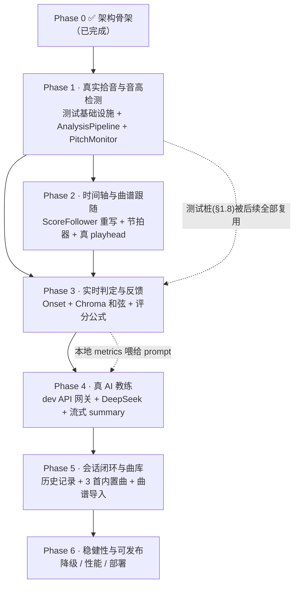

# FRET FLOW 分阶段开发计划（Phase 1 – Phase 6）

> 版本：v1.0　｜　作者：架构师　｜　适用对象：工程师 / QA
> 本文档是**执行手册**，不是设计草稿。每个 Phase 的 DoD 都必须能被客观判定。
> Phase 0（架构骨架）已完成并验证通过，本计划从 Phase 1 开始。

---

## 第 0 章　开工前必须知道的事

### 0.1 当前基线（已验证）

| 项 | 状态 |
|---|---|
| `npx tsc --noEmit` | 零错误 |
| `npx vite build` | 成功，207KB / gzip 65.7KB |
| 开发服务器 | `npx vite --host 127.0.0.1 --port 5180` 可跑 |
| 依赖 | react 19.2.8 / vite 8.2.1 / typescript 5.9.3 / zod 4.4.3 / pitchy 4.1.0 / zustand 5.0.14 / clsx 2.1.1 |
| 骨架代码 | 2499 行，接口签名与 JSDoc 已定义，函数体大量为 TODO |

**已知的 4 个"骨架级缺陷"，必须在对应 Phase 修掉（不要当成新需求，这是欠债）：**

| # | 缺陷 | 位置 | 修复 Phase |
|---|---|---|---|
| D1 | `validateAdvice(fullText)` 把**字符串**喂给 zod object schema，**永远校验失败**，永远走 fallback | `src/lib/coach/agent.ts:146` | Phase 4 |
| D2 | `vite dev` 下**没有任何东西在服务 `/api/coach`**，`api/coach.ts` 是 Vercel Edge Function，dev 时必然 404 | `vite.config.ts` 无 api 中间件 | Phase 4 |
| D3 | `useAudioEngine` 返回 `engine: engineRef.current`，首次渲染恒为 `null`，且引擎创建后**不会触发重渲染** | `src/hooks/useAudioEngine.ts` | Phase 1 |
| D4 | `ScoreFollower` 用 `performance.now()` 计时，与 `AudioContext.currentTime` 不同源，长时间必然漂移 | `src/lib/audio/ScoreFollower.ts` | Phase 2 |

### 0.2 沙箱环境铁律（违反必然浪费半小时）

1. **`package.json` 子进程写不了**（沙箱保护文件）。
   ❌ `npm install X --save` → 装进 node_modules 但写 package.json 时 EPERM。
   ✅ **先用编辑工具手动把依赖写进 `package.json`，再跑 `bash scripts/npm-safe.sh install`（不带 `--save`）**。
2. **npm 缓存目录必须在工作区内，且每次调用用全新缓存目录**（cacache 索引二次追加写必 EPERM）。已固化为 `scripts/npm-safe.sh`。
3. **pnpm 在此环境完全不可用**（safe-delete shim 冲突）。只能用 npm。
4. 满屏 `npm warn cleanup / safe-delete` 是路径转换噪声，**无害，忽略**。
5. **TS 5.9 TypedArray 泛型化**：`AnalyserNode.getFloatTimeDomainData` 只接受 `Float32Array<ArrayBuffer>`，不接受 `Float32Array<ArrayBufferLike>`。所有音频缓冲区声明一律写成 `Float32Array<ArrayBuffer>`。
6. **麦克风无法在沙箱内实测**（`getUserMedia` 需要真实用户手势 + 设备）。
   → 所有涉及真实拾音的验收**必须走 §1.8 的双层测试桩**。任何一条 DoD 如果只能靠"插上吉他弹一下"验证，都必须同时给出一条合成音频的自动化等价判据。

### 0.3 已拍板的架构决策（不可推翻）

1. AI 用 **DeepSeek + 后端代理**（key 在后端，前端只调 `/api/coach`）。
2. 乐器**先聚焦吉他**，架构保留多乐器抽象（`Instrument.kind`）。
3. 音频模式：**麦克风实时采集 + 即时分析 + 与曲谱实时对齐**。
4. 曲谱：**结构化数据 + 内置示例**，AI 只负责反馈，**不生成曲谱**。
5. 音高检测用 **pitchy（YIN）**，不引入 CREPE/TF.js。
6. 和弦识别走**引导式验证**（已知期望和弦，只验证内音能量），不做盲识别。
7. DeepSeek 用 `json_object` response format；**流式期间只渲染 `summary` 做打字机**，流结束再跑 zod 校验。

---

## 第 1 章　跨阶段共享约定（所有 Phase 都要遵守）

> 这一章是防止"写着写着风格漂移"的唯一真源。发生冲突时以本章为准。

### 1.1 命名与文件组织

| 类别 | 规则 | 示例 |
|---|---|---|
| 类 | PascalCase，文件名与类名一致 | `AnalysisPipeline.ts` → `class AnalysisPipeline` |
| 纯函数模块 | camelCase 文件名 | `chroma.ts` / `metrics.ts` |
| 类型/接口 | PascalCase，不加 `I` 前缀 | `AudioFrame`、`PracticeAdvice` |
| 常量 | SCREAMING_SNAKE_CASE，集中在模块顶部 | `DEFAULT_FRAME_SIZE` |
| React 组件 | PascalCase，**具名导出**（与现有骨架一致，不用 default） | `export function CoachPanel()` |
| Hook | `use` 前缀 | `usePitchDetection` |
| 测试 | 与被测文件同目录，`*.test.ts` | `metrics.test.ts` |

**目录职责**（新增目录必须落在这个表里）：

```
src/lib/audio/          音频采集与实时分析（有状态的类）
src/lib/audio/dsp/      纯 DSP 函数（无状态、可单测、不依赖 Web Audio）★新增
src/lib/audio/testing/  合成音频生成器 + 虚拟时钟（仅测试与 dev 用）★新增
src/lib/music/          乐理与曲谱数据模型（纯数据）
src/lib/practice/       评分与统计（纯函数）★新增
src/lib/coach/          AI 教练（schema / prompt / agent / 流解析）
src/lib/store/          zustand stores
src/hooks/              React 适配层（把 lib 的类接到 React 生命周期）
src/components/         纯展示 + 事件转发，禁止直接 new 引擎类
plugins/                Vite 插件（dev API 网关）★新增
api/                    Vercel Edge Functions
```

**硬性分层规则：**
- `src/lib/**` **不得 import React**。
- `src/components/**` **不得 import `src/lib/audio/*` 的类构造器**，只能通过 hooks 拿到实例或数据。
- `src/lib/audio/dsp/**` 和 `src/lib/practice/**` **不得引用 `window` / `AudioContext` / `performance`**（保证 node 环境可单测）。

### 1.2 单位与符号约定（血泪级重要）

| 量 | 单位 | 变量后缀 | 说明 |
|---|---|---|---|
| UI/统计时间 | 毫秒 | `Ms` | `offsetMs`、`durationMs` |
| Web Audio 原生时间 | 秒 | `Sec` | `ctx.currentTime` → `timeSec` |
| 频率 | Hz | `Hz` 或无后缀 | `frequency` |
| 音分 | cents | `Cents` | `centsOff` |
| MIDI | 整数 | `midi` | A4 = 69 |
| 幅度 | 线性 0–1 | `rms` / `level` | dBFS 时后缀 `Db` |

**没有单位后缀的时间变量视为 bug。**

**timing 偏差符号（全局唯一定义）：**

```
offsetMs = expectedOnsetTimeMs - actualOnsetTimeMs
  offsetMs > 0  → 提前（early / 抢拍）
  offsetMs < 0  → 滞后（late / 拖拍）
```

这个符号与 `ScoreFollower.FollowerState.timingOffsetMs` 的注释、`prompt.ts:79` 的中文渲染完全一致，**任何地方不得反号**。

### 1.3 FlowState 状态机（合法迁移表）

现有 `FlowState` 枚举不变，但**必须补齐迁移约束**。在 `sessionStore.setFlowState` 里加 `import.meta.env.DEV` 下的断言，非法迁移 `console.error`。

```
idle ──────────────► requesting_mic ──┬──► listening ──► playing_along ──► stopped
  ▲                                    └──► error(mic_error)                  │
  │                                                                           ▼
  │                                                                       analyzing
  │                                                                           │
  │                                                                           ▼
  │                                                                       streaming
  │                                                                           │
  │                                                                           ▼
  └────────────── resetSession() ◄──────────────────────────────────────── reviewed
                                                                              ▲
        任意状态 ──► error(mic_error | network_error | config_error) ──────────┘
                                （用户点 TRY AGAIN 回到 error 之前的状态）
```

**规则：**
- `analyzing` **只能从 `stopped` 或 `playing_along` 进入**（必须先有数据）。
- `error` 必须携带 `errorType`；`ErrorType` 需新增 `"config_error"`（AI key 未配置）。
- `reviewed` 是终态，只能通过 `resetSession()` 或切歌离开。
- 组件里禁止写"猜测式"的 `setFlowState`，所有迁移收敛到 hooks（`useAudioEngine` / `useCoachSession` / `usePracticeSession`）。

### 1.4 Store 职责边界 + 高频数据禁令

| Store | 职责 | 持久化 |
|---|---|---|
| `transportStore` | **用户意图**：playing / bpm / speedPercent / looping / loopRange / metronomeEnabled / metronomeVolume | ✅ persist（Phase 5 加） |
| `sessionStore` | **单次会话运行时**：flowState / currentScore / 跟随位置 / 统计 / advice | ❌ 不持久化 |
| `audioStore` ★新增 | **硬件与引擎状态**：permission / engineReady / deviceLabel / inputLevelDb / synthMode | ❌ |
| `libraryStore` | 曲库（内置 + 导入） | ✅ persist |
| `historyStore` ★新增 | 练习历史记录 | ✅ persist |

**🚨 高频数据禁令（性能生命线）：**

> 每帧（~21ms）产生的 `AudioFrame` / `PitchResult` / `measureProgress` **绝对不能每帧写 zustand**。
> 21ms 写一次 store 会触发全树重渲染，直接掉到 20fps 以下。

统一方案：新增 `src/lib/audio/AudioBus.ts`（极简发布订阅，非 zustand）：

```ts
// 签名示意，不是实现
export interface AudioBus {
  emitFrame(frame: AudioFrame): void
  subscribe(fn: (f: AudioFrame) => void): () => void
  getSnapshot(): AudioFrame | null
}
```

- 需要**每帧**的消费者（playhead 位移、电平表、TAB 高亮）：用 `useSyncExternalStore(bus.subscribe, bus.getSnapshot)`，并在组件内部用 `requestAnimationFrame` 节流，**UI 更新频率上限 20Hz**。
- 需要**离散事件**的消费者（小节切换、onset 判定结果、反馈气泡）：才允许写 `sessionStore`。
- `measureProgress` 属于每帧数据：**从 `sessionStore` 移除**，改由 AudioBus 提供（Phase 2 执行）。

### 1.5 错误处理与降级策略

1. **`src/lib` 里的可预期失败不 throw**，返回判别联合：
   ```ts
   type Result<T> = { ok: true; value: T } | { ok: false; error: AppError }
   type AppError = { kind: "mic" | "network" | "config" | "parse"; message: string; cause?: unknown }
   ```
   只有"程序员错误"（如 `buildChord` 收到非法和弦名）才 throw。
2. **组件层不 try/catch 业务错误**，只读 `store.errorType` 渲染。
3. **每个失败都有可见降级路径**（不允许静默失败）：

| 失败 | 降级行为 |
|---|---|
| 麦克风被拒绝 / 无设备 | `error(mic_error)` + 提供「**演示模式**」按钮（走 §1.8 L2 合成音源），产品仍可完整走通 |
| `/api/coach` 404 / 5xx / 超时 | `buildFallbackAdvice()` 本地建议 + 顶部黄条提示 |
| `DEEPSEEK_API_KEY` 未配置 | 后端返回 `503 {kind:"config"}`，前端 `error(config_error)`，文案指向 `.env.local` |
| zod 校验失败 | 记 `console.warn` + 用**本地计算的 metrics**拼一个降级 advice（不是全 0 的 fallback） |
| AudioContext 被浏览器 suspend | 检测到 `state !== "running"` 时暂停 follower 并提示"点击继续" |

4. **控制台零未捕获异常**是每个 Phase 的硬 DoD。

### 1.6 音频分析核心参数表（唯一真源）

> 所有参数集中定义在 `src/lib/audio/constants.ts`（★新增），**禁止在各处散落魔法数字**。

| 参数 | 值 | 理由 |
|---|---|---|
| `SAMPLE_RATE` | 设备默认（通常 48000），**不强制指定** | 强制 44100 在部分设备触发重采样噪声 |
| `FRAME_SIZE`（= `analyser.fftSize`） | **4096** | 4096/48000 = 85.3ms，低音 E2(82.4Hz, 周期12.1ms) 可容纳 7 个周期，YIN 才稳。2048 对 E2 只有 3.5 周期，八度误判率高 |
| `HOP_SIZE`（读取间隔） | **1024 样本 ≈ 21.3ms**（≈47 帧/秒） | 足够跟踪 16 分音符（BPM 120 下 125ms） |
| 检测循环驱动 | `requestAnimationFrame` + 时间戳节流到 `HOP_MS` | rAF 比 setInterval 更稳且页面隐藏时自动停 |
| `analyser.smoothingTimeConstant` | **0.0** | 只影响频域数据；chroma 需要瞬时能量，平滑会糊掉 onset |
| `PITCH_MIN_HZ` / `PITCH_MAX_HZ` | 70 / 1320 | E2=82.4Hz 下留余量；吉他 22 品高音 e ≈ 1174Hz |
| `CLARITY_THRESHOLD` | **0.90** | pitchy 的 YIN clarity。骨架里的 0.1 太松，静音时会乱报 |
| `NOISE_GATE_DBFS` | **-50 dBFS**（rms ≥ 0.00316） | 低于此值直接判静音，不做任何检测 |
| `ONSET_MIN_INTERVAL_MS` | **100** | 抑制单次扫弦被判成 6 个 onset |
| `ONSET_FLUX_FACTOR` | **1.5**（相对最近 43 帧中位数） | 自适应阈值，抗环境音量变化 |
| `STABILIZER_CONFIRM_FRAMES` | **3** | 连续 3 帧（≈64ms）同一 midi 才确认，抑制瞬态误判 |
| `STABILIZER_TOLERANCE_CENTS` | **60** | 半音的一半，判"同一个音" |

**噪声门限 + 八度纠错（必须实现，否则静音时满屏乱跳）：**

```
每帧流程：
1. rms = sqrt(mean(buffer²))
2. if (20*log10(rms) < NOISE_GATE_DBFS) → 输出 pitch=null，跳过 YIN
3. [freq, clarity] = pitchy.findPitch(buffer, sampleRate)
4. if (clarity < 0.90 || freq ∉ [70,1320]) → pitch=null
5. 送入 NoteStabilizer：
   - 候选 midi = round(frequencyToMidi(freq))
   - 八度纠错：若 |candidate - lastConfirmed| == 12
       且 lastConfirmed 的 pitchClass ∈ expectedChord.pitchClasses
       且 candidate 的 pitchClass 也相同
     → 采纳 lastConfirmed（吉他低音弦倍频误判的典型形态）
   - 连续 STABILIZER_CONFIRM_FRAMES 帧落在 ±60 cents 内 → 输出 confirmed note
```

### 1.7 评分公式（唯一真源，实现在 `src/lib/practice/metrics.ts`）

> **关键架构决策：四项 metrics 与 overallScore 由前端本地确定性计算，不交给 LLM。**
> LLM 只负责**文字**（summary / highlights / improvements / nextSteps / 建议 BPM 与循环区间）。
> 流程：本地算分 → 把分数写进 user message 喂给 DeepSeek → zod 校验通过后**用本地值覆盖 LLM 返回的 metrics 与 overallScore**。
> 理由：LLM 给的数字不可复现、无法写 DoD；本地公式可单测、可回归。

先定义每帧/每小节的中间量：

```
chroma[12]          — 12 维音级能量，归一化到 max = 1（见 dsp/chroma.ts）
expectedPCs         — 当前小节期望和弦的 pitch class 集合
tonalRatio          = Σ chroma[pc∈expectedPCs] / Σ chroma[0..11]        // 0..1
confirmedNotes      — NoteStabilizer 在该小节输出的确认音（带 centsOff）
onsets              — OnsetDetector 在该小节输出的 {timeMs}
expectedBeatTimesMs — ScoreFollower 给出的该小节拍点绝对时间
```

**① pitchAccuracy（音准）**

```
centsScore  = confirmedNotes.length === 0
            ? null
            : mean( clamp(100 - max(0, |centsOff| - 10) * 2.5, 0, 100) )
              // 死区 ±10 cents 满分；50 cents → 0 分

pitchAccuracy = centsScore === null
              ? tonalRatio * 100
              : 0.6 * tonalRatio * 100 + 0.4 * centsScore
```
> 扫弦时 YIN 不可靠，此时 `confirmedNotes` 为空，自动退化为 chroma 能量比 —— 这是刻意设计。

**② rhythmStability（节奏稳定性）**

```
对每个 onset，取最近的期望拍点，Δ = expectedMs - actualMs（符号见 §1.2）
timingScore(Δ) = clamp(100 - max(0, |Δ| - 40) * (100 / 120), 0, 100)
                 // |Δ| ≤ 40ms → 100 分；|Δ| = 160ms → 0 分

rhythmStability = onsets.length === 0 ? 0 : mean(timingScore(Δ))
```

判定窗口（用于 UI 反馈气泡，与评分同源）：

| \|Δ\| | 判定 | UI |
|---|---|---|
| ≤ 40ms | `perfect` | PERFECT（绿） |
| ≤ 90ms | `good` | GOOD（青） |
| ≤ 160ms | `early` / `late` | EARLY↗ / LATE↘（黄） |
| > 160ms 或无 onset | `miss` | MISS（红） |

**③ chordClarity（和弦清晰度）**

```
matched = { pc ∈ expectedPCs : chroma[pc] ≥ 0.35 }
extra   = { pc ∉ expectedPCs : chroma[pc] ≥ 0.50 }
confidence = 0.7 * (|matched| / |expectedPCs|) + 0.3 * (1 - min(1, |extra| / 3))
chordClarity = mean(confidence over 有效小节) * 100      // 有效 = rms 过门限
```

**④ consistency（一致性）**

```
perMeasure = 0.5 * pitchAccuracy_i + 0.5 * rhythmStability_i
consistency = clamp(100 - stdev(perMeasure) * 2, 0, 100)
              // 标准差 50 分 → consistency 0
```

**⑤ overallScore**

```
overallScore = round(0.35*pitchAccuracy + 0.30*rhythmStability
                   + 0.20*chordClarity  + 0.15*consistency)
```

所有函数签名形如 `computeMetrics(input: SessionAnalytics): Metrics`，**纯函数、无副作用、无 Web Audio 依赖**，必须有单测。

### 1.8 ★ 无麦克风验证方案（双层测试桩）——本计划的地基

沙箱内 `getUserMedia` 不可用，因此**整条分析链路必须能脱离麦克风被驱动**。设计两层注入通道：

#### L1｜纯函数层（node + vitest，无 AudioContext，CI 可跑）

新增 `src/lib/audio/testing/syntheticAudio.ts`：

```ts
// 签名示意
generateSine(freqHz, sampleRate, lengthSamples, amplitude?): Float32Array<ArrayBuffer>
generatePluckedTone(freqHz, sampleRate, lengthSamples, opts?): Float32Array<ArrayBuffer>
  // 谐波幅度 [1, 0.5, 0.33, 0.25, 0.2]，指数衰减包络 τ≈0.8s —— 近似真实拨弦
generateChordTone(freqsHz[], sampleRate, lengthSamples): Float32Array<ArrayBuffer>
generateSilence(sampleRate, lengthSamples): Float32Array<ArrayBuffer>
generateNoise(sampleRate, lengthSamples, dbfs): Float32Array<ArrayBuffer>
renderStrumSequence(events: {atMs, freqsHz}[], sampleRate, totalMs): Float32Array<ArrayBuffer>
```

新增 `src/lib/audio/testing/virtualClock.ts`：一个可手动 `advance(ms)` 的时钟，实现 `Clock` 接口。

**关键接口改造（加法式，不破坏现有签名）：**

| 类 | 新增 | 用途 |
|---|---|---|
| `PitchDetector` | `detectFromBuffer(samples: Float32Array<ArrayBuffer>, sampleRate: number): PitchResult \| null` | 绕开 AudioEngine 直接测 |
| `AnalysisPipeline`★新增 | `processBuffer(samples, sampleRate, timeSec): AudioFrame` | 单帧纯计算入口 |
| `ScoreFollower` | 构造参数增加 `clock?: () => number`（默认 `() => audioCtx.currentTime`，测试传 virtualClock） | 时间可控 |
| `ScoreFollower` | 静态纯函数 `positionAt(measures, bpm, speedPercent, loopRange, elapsedMs): {measureIndex, beatIndex, progress}` | 无状态可穷举单测 |

新增 `src/lib/audio/testing/offlineRunner.ts`：把一段长 `Float32Array` 按 `HOP_SIZE` 切帧，配合 virtualClock 驱动 `AnalysisPipeline → ScoreFollower → metrics`，**完整跑通一次"虚拟练习会话"并返回 `SessionAnalytics`**。这是 Phase 3 的核心验收工具。

#### L2｜浏览器层（无麦克风也能手动演示）

`AudioEngine` 新增：

```ts
attachSyntheticSource(spec:
  | { kind: "oscillator"; freqHz: number }
  | { kind: "buffer"; samples: Float32Array<ArrayBuffer>; loop?: boolean }
): void
```

把 `OscillatorNode` / `AudioBufferSourceNode` 接到 `analyser`，**替代 `micSource`**，其余链路完全不变。

启用方式（二选一，都要实现）：
- URL 参数：`?audio=synth`（默认播放内置的 `Slow Dancing` 和弦序列合成音）
- URL 参数：`?audio=osc:440`（纯 440Hz 正弦，用于校准）

前端在 `audioStore.synthMode` 标记，UI 顶部显示黄色 `DEMO AUDIO` 标签，避免误认为真实拾音。

> **这条通道同时是产品能力**：麦克风被拒绝时的"演示模式"降级路径复用它（见 §1.5）。

#### 测试基础设施

- 新增 `vitest.config.ts`（**独立于 `vite.config.ts`**，绝不复用 Figma 插件链，否则测试环境会去加载 `.figma/make/site.json` 而炸）：
  ```
  test: { environment: "node", include: ["src/**/*.test.ts"] }
  resolve: { alias: { "@": path.resolve(__dirname, "./src") } }
  ```
- `tsconfig.json` 的 `include` 增加 `"vitest.config.ts"`。
- 测试里**显式 import** `describe/it/expect`（不用 globals），避免改 `tsconfig.types`。

---

## 第 2 章　Phase 1：真实拾音与音高检测（"能听见我在弹什么"）

### 阶段目标
> 点击 START LISTENING 后，浏览器真的开始用麦克风采集；屏幕上实时显示当前检测到的音名 / 频率 / 音分偏差 / 输入电平；不弹的时候安安静静不乱跳。**无麦克风环境下走 `?audio=synth` 也能看到同样的效果。**

### 文件清单

| 文件 | 动作 | 说明 |
|---|---|---|
| `package.json` | 修改 | 加 `vitest@^3.2.0` 到 devDependencies；加 scripts：`typecheck` / `test` / `test:watch` |
| `vitest.config.ts` | 新建 | 独立测试配置（§1.8） |
| `tsconfig.json` | 修改 | `include` 加 `vitest.config.ts` |
| `src/lib/audio/constants.ts` | 新建 | §1.6 参数表 |
| `src/lib/audio/types.ts` | 新建 | `AudioFrame` / `Clock` / `Result` / `AppError` |
| `src/lib/audio/dsp/rms.ts` | 新建 | `computeRms` / `rmsToDbfs` / `isAboveGate` |
| `src/lib/audio/dsp/chroma.ts` | 新建 | `computeChroma(freqData, sampleRate, fftSize): Float32Array(12)` |
| `src/lib/audio/NoteStabilizer.ts` | 新建 | 连续帧确认 + 八度纠错 |
| `src/lib/audio/AnalysisPipeline.ts` | 新建 | 每帧产出 `AudioFrame`（rms/pitch/chroma/onset 占位） |
| `src/lib/audio/AudioBus.ts` | 新建 | 高频数据发布订阅（§1.4） |
| `src/lib/audio/AudioEngine.ts` | 修改 | 加 `attachSyntheticSource` / `getFloatFrequencyData` / `inputLevelDb` / `state` 事件；`fftSize` 改 4096 |
| `src/lib/audio/PitchDetector.ts` | 修改 | 加 `detectFromBuffer`；阈值改用 constants；接 NoteStabilizer |
| `src/lib/audio/testing/syntheticAudio.ts` | 新建 | L1 合成音 |
| `src/lib/audio/testing/virtualClock.ts` | 新建 | 虚拟时钟 |
| `src/lib/store/audioStore.ts` | 新建 | permission / engineReady / inputLevelDb / synthMode |
| `src/hooks/useAudioEngine.ts` | 重写 | 修 D3：模块单例 + audioStore 驱动重渲染 |
| `src/hooks/usePitchDetection.ts` | 重写 | rAF + HOP 节流，产出走 AudioBus |
| `src/components/stage/PitchMonitor.tsx` | 新建 | 实时 HUD：音名 / Hz / cents 指针 / 电平条 |
| `src/components/stage/PracticeStage.tsx` | 修改 | 挂 `<PitchMonitor/>` |
| `src/components/coach/CoachPanel.tsx` | 修改 | START LISTENING 接真实 `requestMic()`，去掉 1700ms setTimeout mock |
| `src/index.css` | 修改 | PitchMonitor 样式 |
| 单测 | 新建 | `dsp/rms.test.ts` / `dsp/chroma.test.ts` / `PitchDetector.test.ts` / `NoteStabilizer.test.ts` |

### 任务列表

| ID | 任务 | 依赖 | 说明 |
|---|---|---|---|
| T1.1 | 搭测试基础设施 | — | 手改 package.json → `bash scripts/npm-safe.sh install` → 建 vitest.config.ts → 写一个 smoke test 跑通 |
| T1.2 | `constants.ts` + `types.ts` + 合成音生成器 + 虚拟时钟 | T1.1 | 地基，后续所有 Phase 都用 |
| T1.3 | DSP 纯函数：rms / chroma + 单测 | T1.2 | node 环境可测 |
| T1.4 | `PitchDetector.detectFromBuffer` + `NoteStabilizer` + 单测 | T1.3 | **本 Phase 技术核心** |
| T1.5 | `AudioEngine` 改造（fftSize 4096、频域读取、合成音源、状态上报） | T1.2 | |
| T1.6 | `AnalysisPipeline` + `AudioBus` | T1.4, T1.5 | 每帧产出 AudioFrame |
| T1.7 | `audioStore` + 重写 `useAudioEngine`（修 D3）+ 重写 `usePitchDetection` | T1.6 | |
| T1.8 | `PitchMonitor` 组件 + 样式 + 接入 CoachPanel 的 START LISTENING | T1.7 | 用户可见的增量 |
| T1.9 | URL 参数 `?audio=synth` / `?audio=osc:440` 分支 + DEMO AUDIO 标签 | T1.5, T1.7 | 沙箱验收通道 |

### 核心技术要点

- **`fftSize` 从 2048 提到 4096**：低音 E2 在 2048 窗口下只有 3.5 个周期，YIN 会频繁上跳八度。代价是延迟从 43ms 到 85ms，对"练习反馈"完全可接受。
- **`smoothingTimeConstant` 设 0**：只影响 `getFloatFrequencyData`；chroma 与后续 onset 需要瞬时能量。
- **检测循环用 rAF 而非 setInterval**：骨架里的 `setInterval(tick, 30)` 在标签页后台会被 throttle 到 1Hz 且不通知，rAF 会自动暂停且可感知。循环内用 `performance.now()` 与 `lastHopMs` 比较做 21.3ms 节流。
- **噪声门限先于 YIN 执行**：省 CPU 且从根上杜绝静音乱报。
- **八度纠错依赖期望和弦**：Phase 1 期望和弦还没接进来，先实现"与上一确认音相差整八度时保守采纳低八度"的简化版，Phase 3 接上 `expectedChord` 后升级。
- **`Float32Array<ArrayBuffer>`**：所有缓冲区显式写这个类型（TS 5.9 约束）。
- **AudioContext 生命周期**：`new AudioContext()` 可以在任意时刻创建（会处于 `suspended`），但 `resume()` **必须在用户手势的同步调用栈内**。所以 `requestMic()` 里的顺序必须是 `engine.start()`（resume）→ `await getUserMedia()`，不能反过来。

### DoD（必须逐条可判定）

| # | 判据 | 验证方式 |
|---|---|---|
| 1 | `npx tsc --noEmit` 零错误 | 命令 |
| 2 | `npx vite build` 成功 | 命令 |
| 3 | `npx vitest run` 全绿，且用例数 ≥ 14 | 命令 |
| 4 | 注入 `generateSine(440, 48000, 4096)`，`detectFromBuffer` 返回 `noteName==="A" && octave===4 && Math.abs(centsOff)<5 && clarity>0.95` | 单测 |
| 5 | 注入 `generatePluckedTone(82.41, 48000, 48000)`（E2，含 5 次谐波），逐帧跑满 1 秒，`NoteStabilizer` 输出的 confirmed midi **全部为 40**，出现 midi=52 的帧数为 **0** | 单测 |
| 6 | 注入 `generateNoise(48000, 48000, -70)`，1 秒内 `NoteStabilizer` 输出 confirmed note **0 次** | 单测 |
| 7 | 注入 `generateSilence`，`AnalysisPipeline` 每帧返回 `pitch === null && rms < 0.00316` | 单测 |
| 8 | 注入 `generateChordTone([110, 130.81, 164.81, 196])`（Am7 内音），`computeChroma` 的 top-4 音级为 `{A, C, E, G}`，且第 4 名能量 ≥ 第 5 名的 2 倍 | 单测 |
| 9 | 浏览器打开 `?audio=osc:440`，PitchMonitor 稳定显示 `A4 / 440.0 Hz / 0 cents`，持续 10 秒无跳变 | 人工（沙箱内可做） |
| 10 | 浏览器打开 `?audio=synth`，点 START LISTENING，PitchMonitor 有持续读数，顶部显示 DEMO AUDIO 标签 | 人工（沙箱内可做） |
| 11 | 不带参数打开、拒绝麦克风权限，`flowState === "error"`，`errorType === "mic_error"`，界面出现「切换到演示模式」按钮，**控制台无未捕获异常** | 人工 |
| 12 | 连续运行 60 秒，Performance 面板主线程 scripting 占比 < 25%，无内存持续增长 | 人工（DevTools） |

### 验收命令

```bash
cd "D:/forster children/AI Music Practice Interface"
npx tsc --noEmit
npx vitest run
npx vite build
npx vite --host 127.0.0.1 --port 5180     # 然后访问 /?audio=osc:440 与 /?audio=synth
```

### 风险与回退

| 风险 | 概率 | 应对 / 回退 |
|---|---|---|
| pitchy 对 `generatePluckedTone` 的低音 E2 仍误判八度 | 中 | 先放宽到 `FRAME_SIZE=8192` 单独用于 `PITCH_MIN_HZ<100` 的场景（双窗口）；仍不行则把 `PITCH_MIN_HZ` 提到 100Hz，低音弦只靠 chroma 参与和弦判定，不参与单音判定 |
| `fftSize=4096` 导致移动端掉帧 | 低 | `HOP_SIZE` 放宽到 2048（≈43ms，23fps），DoD #12 仍可满足 |
| vitest 在沙箱装不上 | 低 | 回退到 `node --test` + `tsx`；再不行用一个 `scripts/selftest.ts` 由 `npx tsx` 跑，DoD 判据不变 |
| `?audio=synth` 的 OscillatorNode 因 autoplay policy 不出声 | 中 | 合成音源同样需要用户手势 resume；把演示模式也挂在 START LISTENING 按钮上，不做自动播放 |

---

## 第 3 章　Phase 2：时间轴与曲谱跟随（"播放头真的会走"）

### 阶段目标
> 按下 Play，播放头按 BPM 真实推进，小节高亮自动切换，节拍器出声且与播放头同源；BPM ±、SLOW PRACTICE 50/75/100%、LOOP A—B 全部真实生效；顶部进度条显示真实的段落进度。

### 文件清单

| 文件 | 动作 | 说明 |
|---|---|---|
| `src/lib/audio/ScoreFollower.ts` | 重写 | 修 D4：AudioContext 时钟 + `positionAt` 纯函数 + 保位改速 + seek + loop |
| `src/lib/audio/Metronome.ts` | 修改 | 加 masterGain / setVolume / mute；改为由 follower 的拍点驱动；`dispose` 清理 osc |
| `src/lib/store/transportStore.ts` | 修改 | 加 `metronomeEnabled` / `metronomeVolume` / `setLoopPointA/B`；`loopRange` 与 UI 打通 |
| `src/lib/store/sessionStore.ts` | 修改 | **移除 `measureProgress`**（转 AudioBus）；加 `currentBeatIndex` |
| `src/hooks/useScoreFollower.ts` | 重写 | 单例化、订阅 transportStore 变化、生命周期正确 |
| `src/hooks/useMetronome.ts` | 重写 | 与 follower 同 AudioContext，跟随 bpm/speed |
| `src/hooks/usePracticeSession.ts` | 新建 | **编排层**：把 engine / pipeline / follower / metronome / flowState 串成一个受控会话 |
| `src/components/stage/PracticeStage.tsx` | 修改 | 删掉 `flash` mock 与硬编码 `activeId=19`；真 playhead（rAF + transform，不用 state） |
| `src/components/controls/ControlBar.tsx` | 修改 | LOOP A—B 真实设点；加节拍器开关 |
| `src/components/topbar/TopBar.tsx` | 修改 | 进度条 / 时间读数改为真实计算（删掉 `02:41 / 05:14` 硬编码） |
| `src/index.css` | 修改 | playhead 动画改为 transform 驱动 |
| 单测 | 新建 | `ScoreFollower.test.ts`（positionAt 穷举 + 循环边界 + 变速保位） |

### 任务列表

| ID | 任务 | 依赖 | 说明 |
|---|---|---|---|
| T2.1 | 抽出 `positionAt` 纯函数 + 单测（含 loop 边界、末尾停止、变速） | Phase 1 | 先测后用 |
| T2.2 | `ScoreFollower` 重写：注入 `Clock`、AudioContext 时钟、保位 `setBpm`、`seekToMeasure`、loop | T2.1 | 修 D4 |
| T2.3 | `Metronome` 改造 + `useMetronome` 重写（同 ctx、跟随 bpm、音量、静音） | T2.2 | |
| T2.4 | `transportStore` 扩展 + `sessionStore` 精简（移 measureProgress） | T2.2 | |
| T2.5 | `usePracticeSession` 编排层 | T2.2, T2.3, T2.4 | 后续 Phase 都挂这里 |
| T2.6 | `PracticeStage` 真 playhead + 去 mock；`ControlBar` LOOP A—B；`TopBar` 真进度 | T2.5 | 用户可见增量 |

### 核心技术要点

**① AudioContext 时钟映射（修 D4）**

```
startCtxSec      = ctx.currentTime（start 时刻记录）
pausedAccumSec   = 累计暂停时长
effectiveBpm     = bpm * speedPercent / 100
beatDurMs        = 60000 / effectiveBpm
elapsedMs        = (ctx.currentTime - startCtxSec - pausedAccumSec) * 1000
```
`ctx.currentTime` 是音频硬件时钟，与节拍器调度、拾音时间戳**同源**，这是 timing offset 能算准的前提。
`AudioFrame.timeSec` 也必须用 `ctx.currentTime`，**不要用 `performance.now()`**。

> 注意：`AnalyserNode` 读到的是"最近 4096 个样本"，其**中心时刻**约为 `ctx.currentTime - FRAME_SIZE/2/sampleRate ≈ -42.7ms`。onset 时间戳必须做这个补偿，否则所有 offset 恒偏 40ms。**在 `AnalysisPipeline` 里统一减掉 `ANALYSIS_LATENCY_MS = FRAME_SIZE/2/sampleRate*1000`。**

**② 保位变速**（骨架里是 TODO）

```
setBpm(newBpm):
  const beatsElapsed = elapsedMs / beatDurMs(oldBpm)   // 先记住当前"音乐位置"
  bpm = newBpm
  startCtxSec = ctx.currentTime - beatsElapsed * beatDurMs(newBpm)/1000 - pausedAccumSec
```
`setSpeed` 同理。DoD 会验证"改 BPM 时 currentMeasureId 不跳变"。

**③ `positionAt` 纯函数签名**

```ts
positionAt(
  measures: Measure[], bpm: number, speedPercent: number,
  loopRange: { startId: number; endId: number } | null,
  elapsedMs: number,
): { measureIndex: number; measureId: number; beatIndex: number; progress: number; beatTimeMs: number }
```
无状态、无副作用 → 可以穷举 0..30000ms 每 1ms 断言单调性与边界。

**④ playhead 渲染禁令**

playhead 位置**不允许**走 React state（47Hz setState 会炸）。做法：
- `PracticeStage` 用 `useRef` 拿到 playhead DOM 节点
- `useEffect` 里订阅 `AudioBus`，在 rAF 回调里直接 `el.style.transform = translateX(...)`
- 只有**小节切换**这种离散事件才 `setState` / 写 store

**⑤ 节拍器串音风险**：节拍器接 `ctx.destination`，会被麦克风拾到，污染 onset 检测。
- 默认 `metronomeVolume = 0.25`
- UI 明确提示「建议佩戴耳机」
- `metronomeEnabled` 默认 **false**（用户主动开）

### DoD

| # | 判据 | 验证 |
|---|---|---|
| 1 | `npx tsc --noEmit` 零错误、`npx vite build` 成功、`npx vitest run` 全绿 | 命令 |
| 2 | `positionAt` 单测：BPM 92、4/4、单小节时长 = 4×60000/92 = **2608.70ms**；`elapsedMs=2608` → measureId=17，`elapsedMs=2609` → measureId=18；切换点误差 < 1ms | 单测 |
| 3 | `positionAt` 单测：`speedPercent=50` 时单小节时长 = **5217.39ms**（=2608.70×2）；`speedPercent=75` → 3478.26ms | 单测 |
| 4 | `positionAt` 单测：`loopRange={17,20}`，`elapsedMs = 4×2608.70 + 100` → 回到 measureId=17 且 `progress ≈ 100/2608.70` | 单测 |
| 5 | `positionAt` 单测：无 loop 且 `elapsedMs` 超过全曲时长 → 停在最后一小节，`progress===1`，不越界不抛错 | 单测 |
| 6 | 保位变速单测：虚拟时钟推进到 measureId=19 的 50% 处，调用 `setBpm(120)`，立即 `getState()` 仍为 measureId=19 且 `|progress-0.5| < 0.01` | 单测 |
| 7 | 浏览器：点 Play，playhead 从左到右平滑移动，小节高亮每 2.61 秒切换一次（用秒表对 4 个小节 = 10.4±0.3 秒） | 人工 |
| 8 | 浏览器：点 SLOW PRACTICE 切到 50%，同样 4 个小节耗时 20.9±0.5 秒 | 人工 |
| 9 | 浏览器：开启节拍器，click 声与 playhead 过小节线的视觉时刻**主观同步**（无可察觉偏差），且连续 60 秒不漂移 | 人工 |
| 10 | 浏览器：连点 BPM+ 十次（92→112），高亮小节**不跳变**，playhead 不回退 | 人工 |
| 11 | 浏览器：LOOP A—B 设 A=18、B=20，播放到 20 末尾自动回到 18，循环 3 次无卡顿 | 人工 |
| 12 | Performance 面板：播放中 FPS ≥ 55，React commit 次数 ≤ 2 次/秒（证明 playhead 没走 state） | 人工（React DevTools Profiler） |

### 风险与回退

| 风险 | 应对 |
|---|---|
| `ctx.currentTime` 在 Safari 上 suspend 后不推进 | 监听 `statechange`，非 `running` 时自动 pause follower 并提示 |
| 节拍器串音污染 onset | 默认关闭 + 音量 0.25 + 耳机提示；Phase 3 若实测干扰严重，改为**视觉节拍器**（闪烁），彻底消除串音 |
| playhead 直接改 DOM 与 React 冲突 | 只改 `transform`，不改结构；组件卸载时清 rAF |
| 全曲进度条需要"整曲时长"，但内置曲谱只有 12 小节 | 进度条改为显示**当前练习段落**进度（Bars 17–28），文案同步改，不虚构 05:14 |

---

## 第 4 章　Phase 3：实时判定与反馈（"它知道我弹对没弹对"）

### 阶段目标
> 弹对了立刻出 PERFECT / GOOD，抢拍出 EARLY↗、拖拍出 LATE↘、没弹出 MISS；TAB 谱上弹错的弦标红、弹对的弦标绿；练习结束能得到一份本地计算的四维评分。**全程可用合成音频在沙箱内验证。**

### 文件清单

| 文件 | 动作 | 说明 |
|---|---|---|
| `src/lib/audio/dsp/spectralFlux.ts` | 新建 | 频谱通量计算（纯函数） |
| `src/lib/audio/OnsetDetector.ts` | 新建 | 自适应阈值 onset 检测 + 最小间隔抑制 |
| `src/lib/audio/AnalysisPipeline.ts` | 修改 | 接入 onset；`AudioFrame.onset` 填真值；减去 `ANALYSIS_LATENCY_MS` |
| `src/lib/audio/ChordRecognizer.ts` | 修改 | 加 `recognizeFromChroma(chroma, expected): ChordMatch`；旧 `recognize` 保留为委托 |
| `src/lib/audio/ScoreFollower.ts` | 修改 | 加 `ingestFrame(frame: AudioFrame)`（统一漏斗）；`ingestPitch` 保留为委托；产出 `TimingJudgement` |
| `src/lib/practice/types.ts` | 新建 | `MeasureStats` / `SessionAnalytics` / `TimingJudgement` |
| `src/lib/practice/metrics.ts` | 新建 | §1.7 全部公式（纯函数） |
| `src/lib/practice/collector.ts` | 新建 | 逐帧累积 → `SessionAnalytics` |
| `src/lib/audio/testing/offlineRunner.ts` | 新建 | 离线驱动整条链路（★验收核心） |
| `src/lib/store/sessionStore.ts` | 修改 | 加 `measureStats` / `analytics`；`lastFeedback` 扩展 early/late |
| `src/hooks/usePracticeSession.ts` | 修改 | 串 pipeline → follower → collector |
| `src/components/stage/PracticeStage.tsx` | 修改 | 反馈气泡真实化（含 EARLY/LATE）；TAB 弦着色 |
| `src/components/stage/FeedbackBubble.tsx` | 新建 | 从 PracticeStage 抽出，带进出动画与 800ms 自动消失 |
| `src/index.css` | 修改 | 反馈色板（perfect/good/early/late/miss） |
| 单测 | 新建 | `spectralFlux.test.ts` / `OnsetDetector.test.ts` / `ChordRecognizer.test.ts` / `metrics.test.ts` / `offlineRunner.test.ts` |

### 任务列表

| ID | 任务 | 依赖 | 说明 |
|---|---|---|---|
| T3.1 | `spectralFlux` + `OnsetDetector` + 单测 | Phase 2 | 用 `renderStrumSequence` 验证 |
| T3.2 | `ChordRecognizer.recognizeFromChroma` + 单测 | Phase 1 chroma | 引导式验证 |
| T3.3 | `practice/types.ts` + `metrics.ts` 全部公式 + 单测（fixture 驱动） | — | 可与 T3.1/T3.2 并行 |
| T3.4 | `ScoreFollower.ingestFrame` + `TimingJudgement` 判定窗口 | T3.1, Phase 2 | |
| T3.5 | `collector.ts` + `offlineRunner.ts` + 端到端离线单测 | T3.1–T3.4 | **★本 Phase 最重要的验收工具** |
| T3.6 | UI：`FeedbackBubble` + TAB 弦着色 + 接线 | T3.4, T3.5 | 用户可见增量 |

### 核心技术要点

**① 为什么和弦判定不能用 YIN**
扫弦时 6 根弦同时发声，YIN 是**单音基频**算法，输出没有意义。因此：
- **单音段落**（`confirmedNotes` 非空）→ 用 cents 判音准
- **和弦/扫弦**（YIN 无稳定输出）→ 用 **chroma 能量匹配**判和弦
- 这就是 §1.7 中 `pitchAccuracy` 双分支公式的由来，**不是权宜之计，是正确做法**

**② Onset 检测（频谱通量法）**

```
mag[i]        = 10^(freqDb[i]/20)                    // getFloatFrequencyData 是 dB
flux          = Σ max(0, mag[i] - prevMag[i])        // 只累加正增量
threshold     = median(flux 最近 43 帧) * ONSET_FLUX_FACTOR(1.5) + 1e-6
isOnset       = flux > threshold
              && rms > gate
              && (nowMs - lastOnsetMs) > ONSET_MIN_INTERVAL_MS(100)
onsetTimeMs   = frame.timeSec*1000 - ANALYSIS_LATENCY_MS   // 补偿分析窗中心
```
43 帧 ≈ 916ms，用**中位数**而非均值以抗离群值。

**③ Timing 判定**

```
对每个 onset：
  在 ScoreFollower 当前拍网格上找最近拍点 expectedMs
  Δ = expectedMs - onsetTimeMs           // 符号见 §1.2
  |Δ| ≤ 40   → perfect
  |Δ| ≤ 90   → good
  |Δ| ≤ 160  → Δ>0 ? early : late
  否则        → 不计入（视为噪声或额外音），不产生 miss
每小节结束时若该小节 onset 数 === 0 且期望有音 → 记 miss
```
`ScoreFollower` 每次判定后 `callbacks.onDetectionMatch` 输出 `{judgement, offsetMs, measureId}`，
**写 sessionStore（离散事件，允许）**，UI 弹气泡。

**④ 反馈气泡节流**：同一小节内最多弹 1 次气泡（取该小节第一个 onset 的判定），
避免扫弦 4 下弹 4 个气泡把界面刷爆。

**⑤ TAB 弦着色**：本 Phase 只做**小节级**着色（整个小节的 6 根弦按 `ChordMatch.matchedNotes` / `missingNotes` 着色），
**不做单弦实时判定**（麦克风单声道无法区分是哪根弦弹的，做不出来就别规划）。

### DoD

| # | 判据 | 验证 |
|---|---|---|
| 1 | `tsc --noEmit` / `vite build` / `vitest run` 三项通过 | 命令 |
| 2 | `renderStrumSequence` 生成 8 次扫弦（间隔 652ms，对应 BPM 92 的 4 分音符），`OnsetDetector` 检出 **恰好 8 个** onset，每个的时间戳与真值偏差 **< 25ms** | 单测 |
| 3 | 同上序列人为加 ±60ms 抖动，检出仍为 8 个，检出时间戳与真值偏差 < 25ms | 单测 |
| 4 | 纯静音 3 秒 → onset 检出 **0 个** | 单测 |
| 5 | `generateChordTone(Am7 内音)` → `recognizeFromChroma(chroma, Am7)` 返回 `confidence ≥ 0.90`，`missingNotes.length === 0` | 单测 |
| 6 | 同一段 Am7 音频，`recognizeFromChroma(chroma, buildChord("G"))` 返回 `confidence ≤ 0.45` | 单测（负例，防止恒真） |
| 7 | `metrics.computeMetrics` fixture 测试：给定 20 个 Δ = `[0,±20,±45,±80,±150,...]` 的固定数组，`rhythmStability` 输出与手算期望值误差 < 0.5 | 单测 |
| 8 | `metrics` 边界测试：全 perfect → 四项均 = 100 且 `overallScore === 100`；无任何输入 → 四项均 = 0 且不抛错、不 NaN | 单测 |
| 9 | **端到端离线**：`offlineRunner` 喂入"BPM 92、Am7→Fmaj7→C→G 各 1 小节、每小节 4 次准时扫弦"的合成音频，返回的 `SessionAnalytics` 满足：`rhythmStability ≥ 85`、`chordClarity ≥ 80`、`practicedMeasures.length === 4`、`timingOffsets.length === 16` | 单测 ★ |
| 10 | **端到端负例**：同上但所有 onset 统一延后 120ms，`rhythmStability ≤ 45`，且 `timingOffsets` 中位数 ∈ [-135, -105]（负=滞后） | 单测 ★ |
| 11 | 浏览器 `?audio=synth`：播放中反馈气泡按小节出现，文案在 PERFECT/GOOD/EARLY/LATE 中变化，**不会同一小节连弹多次** | 人工 |
| 12 | 浏览器：停止后 `sessionStore.analytics` 有完整四维分数，均在 0–100 且非 NaN（DevTools 查看） | 人工 |
| 13 | 控制台零未捕获异常；播放中 FPS ≥ 55 | 人工 |

### 风险与回退

| 风险 | 应对 / 回退 |
|---|---|
| 真实吉他扫弦的 chroma 泛音污染导致 `confidence` 普遍偏低 | 把 chroma 累加限制在 **80–1200Hz**，并对每个 bin 做 `1/f` 加权；仍不行则把 `matched` 阈值从 0.35 降到 0.25 并记录在 constants（改常量不改结构） |
| 房间混响导致 onset 拖尾误检 | 提高 `ONSET_MIN_INTERVAL_MS` 到 150；仍不行则加一个 3 帧的 flux 平滑 |
| 合成音频过于"干净"，DoD 通过但真机不行 | `generatePluckedTone` 必须带谐波 + 衰减包络；另外准备 1 个真实吉他录音 wav 放 `src/lib/audio/testing/fixtures/`（≤200KB，单声道 22kHz），作为回归样本 |
| 单声道无法区分弦 | 已在设计中放弃单弦判定，只做小节级着色（不是风险，是范围声明） |

---

## 第 5 章　Phase 4：真 AI 教练（"它真的在给我建议"）

### 阶段目标
> 练习结束点 GENERATE PRACTICE NOTES，真实调用 DeepSeek；流式期间只用 `summary` 做打字机；流结束展示结构化建议卡片（四维评分条 / 亮点 / 改进项+drill / 下一步 / 一键应用建议 BPM 与循环区间）。**dev 环境下 `/api/coach` 真的可用。**

### 文件清单

| 文件 | 动作 | 说明 |
|---|---|---|
| `plugins/devApiPlugin.ts` | 新建 | **修 D2**：Vite dev 中间件，把 `/api/*` 路由到 `api/*.ts` 的 edge handler |
| `vite.config.ts` | 修改 | plugins 数组加入 `devApiPlugin()`；用 `loadEnv` 注入 `DEEPSEEK_API_KEY` |
| `.env.example` | 新建 | `DEEPSEEK_API_KEY=` / `DEEPSEEK_MODEL=deepseek-chat` / `DEEPSEEK_BASE_URL=https://api.deepseek.com` |
| `.gitignore` | 修改 | 加 `.env.local` |
| `api/_deepseek.ts` | 新建 | DeepSeek SSE 客户端（上游流解析 + 错误映射 + 超时） |
| `api/coach.ts` | 重写 | 真实调用；保留 `?mock=1` 走原 MOCK（回归测试用） |
| `src/lib/coach/streamParser.ts` | 新建 | **增量 summary 提取器**（★核心） |
| `src/lib/coach/agent.ts` | 修改 | **修 D1**：`JSON.parse` 后再 zod；接 streamParser；加 AbortSignal + 30s 超时 + 1 次重试 |
| `src/lib/coach/prompt.ts` | 修改 | user message 加入本地计算的 metrics 与每小节明细 |
| `src/lib/coach/schema.ts` | 修改 | `ErrorType` 相关：新增 `CoachErrorSchema`；`validateAdvice` 增加"用本地 metrics 覆盖"的 helper |
| `src/lib/store/sessionStore.ts` | 修改 | `ErrorType` 加 `"config_error"` |
| `src/hooks/useCoachSession.ts` | 重写 | 真实 snapshot（含 analytics）+ abort + 重试 + 状态机 |
| `src/components/coach/CoachPanel.tsx` | 重写 | 删除 `MOCK_ADVICE_TEXT` 与假打字机；结构化卡片渲染；删掉 `dangerouslySetInnerHTML` |
| `src/components/coach/AdviceCard.tsx` | 新建 | 评分条 / highlights / improvements / nextSteps / 应用按钮 |
| `src/components/coach/MetricBar.tsx` | 新建 | 单条评分可视化 |
| `src/index.css` | 修改 | 建议卡片样式 |
| 单测 | 新建 | `streamParser.test.ts` / `agent.test.ts`（mock fetch）/ `schema.test.ts` |

### 任务列表

| ID | 任务 | 依赖 | 说明 |
|---|---|---|---|
| T4.1 | `plugins/devApiPlugin.ts` + `vite.config.ts` 接线 + `.env.example` | — | **修 D2，先做，否则后面全靠猜** |
| T4.2 | `api/_deepseek.ts` + `api/coach.ts` 真实实现（含 `?mock=1` 回退） | T4.1 | |
| T4.3 | `streamParser.ts` 增量 summary 提取 + 单测 | — | 可与 T4.2 并行 |
| T4.4 | `agent.ts` 修 D1 + 接 streamParser + 超时/重试/abort + 单测 | T4.3 | |
| T4.5 | `prompt.ts` 注入 analytics；`validateAdvice` 覆盖本地 metrics | Phase 3 | |
| T4.6 | `useCoachSession` 重写 + 状态机接线 | T4.4, T4.5 | |
| T4.7 | `CoachPanel` / `AdviceCard` / `MetricBar` UI 重写 + 一键应用建议 | T4.6 | 用户可见增量 |

### 核心技术要点

**① dev API 网关（修 D2）**

```ts
// plugins/devApiPlugin.ts —— 签名示意
export function devApiPlugin(): Plugin {
  return {
    name: "dev-api",
    configureServer(server) {
      server.middlewares.use(async (req, res, next) => {
        if (!req.url?.startsWith("/api/")) return next()
        const mod = await server.ssrLoadModule("/api/coach.ts")   // ★用 ssrLoadModule 转译 TS
        const body = await readNodeBody(req)
        const request = new Request(new URL(req.url, "http://localhost"), {
          method: req.method, headers: req.headers as HeadersInit, body,
        })
        const response = await mod.default(request)
        res.statusCode = response.status
        response.headers.forEach((v, k) => res.setHeader(k, v))
        if (response.body) Readable.fromWeb(response.body as any).pipe(res)
        else res.end()
      })
    },
  }
}
```
要点：
- 用 `server.ssrLoadModule` 而不是 `import()`，才能转译 TS 且支持 HMR
- **必须真流式**：用 `Readable.fromWeb(...).pipe(res)`，不要 `await response.text()`，否则打字机效果没了
- SSE 响应必须 `res.setHeader("X-Accel-Buffering","no")` 并禁用 compression

**② DeepSeek 调用参数**

```
POST https://api.deepseek.com/chat/completions
Authorization: Bearer ${DEEPSEEK_API_KEY}
{
  model: "deepseek-chat",
  messages: [{role:"system",content:COACH_SYSTEM_PROMPT},{role:"user",content:userMessage}],
  response_format: { type: "json_object" },
  stream: true,
  temperature: 0.3,          // 结构化输出用低温
  max_tokens: 1500
}
```
- `json_object` 模式要求 prompt 里出现 "JSON" 字样 —— 现有 `COACH_SYSTEM_PROMPT` 已满足 ✅
- 上游 SSE 行格式：`data: {"choices":[{"delta":{"content":"..."}}]}`，结束为 `data: [DONE]`
- 后端把上游 `delta.content` **原样重新包装**成本项目自己的 SSE 帧 `data: {"delta":"...","done":false}`（保持 `agent.ts` 现有协议不变），最后发 `data: {"done":true}`
- 超时 30s（服务端 `AbortController`）；上游非 2xx → 返回 `{kind:"network"}`；无 key → `503 {kind:"config"}`

**③ 增量 summary 提取（决策 7 的落地）**

LLM 输出的是完整 JSON 字符串，但**打字机只能显示 `summary` 的内容**。做一个极简的流式扫描器（不是完整 JSON parser）：

```ts
// streamParser.ts 签名示意
export function createSummaryStreamer(): {
  push(deltaChunk: string): string   // 返回本次新增的、属于 summary 的可见文本（可能为空串）
  getFullText(): string              // 累积的完整原始 JSON 文本
  isSummaryDone(): boolean
}
```
状态机：`SEEKING_KEY`（找 `"summary"`）→ `SEEKING_COLON` → `SEEKING_QUOTE` → `IN_STRING`（处理 `\"` `\\` `\n` 转义）→ `DONE`。
`IN_STRING` 期间每来一个字符就作为可见增量吐出。`DONE` 之后 push 只累积不吐出。

**④ 修 D1 + 本地 metrics 覆盖**

```
流结束：
  raw = streamer.getFullText()
  try { obj = JSON.parse(stripCodeFence(raw)) } catch → 降级
  { advice, error } = validateAdvice(obj)          // ★ 传对象，不是字符串
  if (advice) {
    advice.metrics      = localMetrics             // 本地覆盖（§1.7 决策）
    advice.overallScore = localOverallScore
  } else {
    advice = buildDegradedAdvice(localMetrics, raw) // 分数用本地真值，文字用兜底
  }
```
`stripCodeFence`：即使要求了不要 markdown，也要防御 ```` ```json ```` 包裹。

**⑤ CoachPanel 安全性**：删除 `dangerouslySetInnerHTML`。结构化数据渲染，不需要富文本。

**⑥ 一键应用**：`AdviceCard` 底部按钮
- 「应用建议速度」→ `transportStore.setBpm(advice.recommendedBpm)`
- 「循环这段」→ `transportStore.setLoopRange(...)` + `setLooping(true)` + `follower.seekToMeasure(start)`

### DoD

| # | 判据 | 验证 |
|---|---|---|
| 1 | `tsc --noEmit` / `vite build` / `vitest run` 三项通过 | 命令 |
| 2 | `curl -s -X POST http://127.0.0.1:5180/api/coach?mock=1 -H "Content-Type: application/json" -d '{"session":{}}'` 返回 **200** 且响应体含 `data: {"delta"` —— 证明 dev 网关工作（修 D2） | 命令 ★ |
| 3 | 同上但**分块到达**：`curl -N` 观察输出**不是一次性吐完**（证明真流式） | 命令 |
| 4 | 未配置 `DEEPSEEK_API_KEY` 时请求 `/api/coach`（不带 mock）返回 **503** 且 body 含 `"kind":"config"` | 命令 |
| 5 | `streamParser` 单测：把一段完整 advice JSON **按随机长度（1–7 字符）切成 ≥ 40 块**依次 push，拼接出的可见文本 **=== 原 summary 字符串**（逐字符相等） | 单测 ★ |
| 6 | `streamParser` 单测：summary 内含 `\"` 与 `\n` 转义时，输出正确解转义，不提前 DONE | 单测 |
| 7 | `streamParser` 单测：`summary` 不是第一个 key（出现在 `metrics` 之后）时仍能正确提取 | 单测 |
| 8 | `agent` 单测（mock fetch 返回固定 SSE）：最终 `chunk.done === true` 且 `chunk.advice` 通过 zod，`advice.metrics` **等于传入的本地 metrics**（证明覆盖生效） | 单测 ★ |
| 9 | `agent` 单测：mock 返回**非法 JSON** → 不抛错，返回降级 advice，且 `advice.overallScore === localOverallScore`（不是 0） | 单测 |
| 10 | `agent` 单测：mock fetch reject（网络错误）→ 返回 fallback，`flowState` 可达 `reviewed` | 单测 |
| 11 | 浏览器（配好真 key）：完整走一遍 练习→停止→GENERATE，打字机显示的是**中文自然语言 summary，不是 JSON 字符串**；流结束后出现结构化卡片 | 人工 ★ |
| 12 | 浏览器：DevTools 切 Offline 后点 GENERATE，**3 秒内**出现 fallback 卡片，`flowState === "reviewed"`，控制台无未捕获异常 | 人工 |
| 13 | 浏览器：点「应用建议速度」，`transportStore.bpm` 变为 `advice.recommendedBpm`，ControlBar 显示同步更新 | 人工 |
| 14 | `git grep -n "MOCK_ADVICE_TEXT\|dangerouslySetInnerHTML" src/` **无结果** | 命令 |

### 风险与回退

| 风险 | 应对 / 回退 |
|---|---|
| `ssrLoadModule` 在 Vite 8 行为变化 | 回退方案：dev 网关不加载 `api/coach.ts`，而是在插件内直接 `fetch` DeepSeek（逻辑抽到 `api/_deepseek.ts` 共用，两边都 import 它）。这也是把 `_deepseek.ts` 独立出来的原因 |
| DeepSeek 偶发不遵守 JSON 格式 | `stripCodeFence` + 1 次自动重试（第二次在 user message 尾部追加"上次输出不是合法 JSON，请只输出 JSON"）+ 本地 metrics 兜底 |
| SSE 被中间层缓冲，打字机变成一次性出现 | 设 `X-Accel-Buffering: no`、`Cache-Control: no-cache, no-transform`；dev 侧确认没走 compression 中间件 |
| Vercel Edge 冷启动 + DeepSeek 首 token 慢（>5s） | `analyzing` 状态显示骨架屏与"AI 正在分析…"，30s 超时；UI 不做假进度条 |
| 沙箱内无真实 key 无法验 DoD #11 | DoD #11 标为**人工/需真 key**；沙箱内用 `?mock=1` 验 #2/#3 与全部单测，真 key 验收交给用户环境 |

---

## 第 6 章　Phase 5：会话闭环与曲库（"练完能存下来，下次接着练"）

### 阶段目标
> 一次练习形成完整闭环：选曲 → 练 → 得到建议 → **自动存进历史** → HISTORY 里能看到每次的分数趋势与当时的建议；曲库支持切歌、内置 3 首曲谱、支持导入**曲谱 JSON**（不再假装能导入音频）。

### 文件清单

| 文件 | 动作 | 说明 |
|---|---|---|
| `src/lib/store/historyStore.ts` | 新建 | persist；`PracticeRecord[]`；上限 100 条 |
| `src/lib/practice/record.ts` | 新建 | `SessionAnalytics + PracticeAdvice → PracticeRecord` |
| `src/lib/music/scores/index.ts` | 新建 | 内置曲谱注册表 |
| `src/lib/music/scores/wonderwall.ts` | 新建 | 内置曲 2（简单：Em7-G-Dsus4-A7sus4） |
| `src/lib/music/scores/knockinOnHeavensDoor.ts` | 新建 | 内置曲 3（最简：G-D-Am / G-D-C） |
| `src/lib/music/scoreSchema.ts` | 新建 | Score 的 zod schema（导入校验用） |
| `src/lib/store/libraryStore.ts` | 修改 | 注册 3 首内置曲；`importScore(json)` 走 zod；`selectSong` |
| `src/lib/store/sessionStore.ts` | 修改 | `loadScore(scoreId)`：切歌时 `resetSession` + follower seek 到首小节 |
| `src/lib/store/transportStore.ts` | 修改 | 加 persist（bpm/speed/metronome 记忆） |
| `src/components/library/LibraryView.tsx` | 修改 | 真实切歌；导入改为 `.json`；空态与错误态 |
| `src/components/library/HistoryView.tsx` | 新建 | 历史列表 + 分数趋势（纯 SVG 折线，不引图表库） |
| `src/components/topbar/TopBar.tsx` | 修改 | 曲目下拉切换；HISTORY 进 HistoryView；ADD SONG 改 `.json` |
| `src/App.tsx` | 修改 | `view` 加 `"history"` |
| `src/hooks/usePracticeSession.ts` | 修改 | `reviewed` 时自动落库 |
| `src/index.css` | 修改 | 历史与曲库样式 |
| 单测 | 新建 | `scoreSchema.test.ts` / `record.test.ts` / 3 首内置曲谱的结构校验 |

### 任务列表

| ID | 任务 | 依赖 | 说明 |
|---|---|---|---|
| T5.1 | `scoreSchema.ts` + 2 首新内置曲谱 + 注册表 + 单测 | — | |
| T5.2 | `historyStore` + `record.ts` + 落库时机（`reviewed` 时） | Phase 4 | |
| T5.3 | `libraryStore` 切歌 / 导入 JSON；`sessionStore.loadScore` | T5.1 | |
| T5.4 | `HistoryView` + 趋势 SVG；`LibraryView` 重构；`TopBar` 切歌 | T5.2, T5.3 | 用户可见增量 |
| T5.5 | `transportStore` persist + 迁移策略（版本号 + `migrate`） | — | |

### 核心技术要点

- **"ADD SONG 导入音频"是伪功能，必须改掉**：从音频自动转谱是一个独立的大工程（且与决策 4 冲突）。改为「导入曲谱 JSON」，并在 UI 明确写"支持 FRET FLOW 曲谱格式（.json）"，附一个「下载曲谱模板」按钮导出当前曲谱作为样例。
- **导入必须 zod 校验**：`scoreSchema.safeParse`，失败时把 `error.issues` 前 3 条展示给用户（可读的中文），**绝不静默吞掉**。
- **`PracticeRecord` 结构**：
  ```ts
  { id, scoreId, scoreTitle, startedAt, durationMs, bpm, speedPercent,
    measureRange: [number, number], metrics: Metrics, overallScore: number,
    adviceSummary: string, advice: PracticeAdvice | null }
  ```
  `advice` 全量存（用于回看），但 `historyStore` 上限 100 条 + `partialize` 时对超过 100 条的做 FIFO 淘汰，防止 localStorage 爆 quota。
- **zustand persist 版本迁移**：所有 persist store 加 `version: 1` 与 `migrate`，避免以后改结构导致用户 localStorage 里的旧数据让应用白屏。
- **趋势图不引图表库**：`<svg>` 手绘折线（≤ 60 行），保持包体不膨胀。
- **切歌必须重置**：`loadScore` 内部顺序 = `follower.stop()` → `resetSession()` → `setCurrentScore()` → `follower = new ScoreFollower(score)` → `seekToMeasure(first)`。顺序错会导致旧曲的 measureId 落到新曲上。

### DoD

| # | 判据 | 验证 |
|---|---|---|
| 1 | `tsc --noEmit` / `vite build` / `vitest run` 三项通过 | 命令 |
| 2 | 3 首内置曲谱全部通过 `scoreSchema.safeParse`，且 `flattenMeasures().length ≥ 8`，`measure.id` 全局唯一递增 | 单测 |
| 3 | `scoreSchema` 负例：缺 `bpm` / `measures` 为空数组 / `chord.name` 无法解析 → `safeParse` 失败且 `issues` 非空 | 单测 |
| 4 | `record.ts` 单测：给定 analytics + advice → 生成的 `PracticeRecord` 字段完整、`overallScore` 与 analytics 一致 | 单测 |
| 5 | `historyStore` 单测：连续 push 120 条，`records.length === 100` 且保留的是最新 100 条 | 单测 |
| 6 | 浏览器：在曲库点第 2 首歌 → TopBar 标题变化、TAB 谱内容变化、`currentMeasureId` 重置为新曲首小节 | 人工 |
| 7 | 浏览器：导入一个**故意缺字段**的 JSON → 出现中文错误提示且**不崩溃**、曲库不新增条目 | 人工 |
| 8 | 浏览器：完成一次练习（可用 `?audio=synth`），HISTORY 中出现新记录，含分数与 summary；刷新页面后记录仍在 | 人工 ★ |
| 9 | 浏览器：`localStorage` 中 `fretflow-*` 键存在且 JSON 合法；手动把某个键改成 `"{"`（损坏），刷新后应用**正常启动**（persist 解析失败降级到初始值），不白屏 | 人工 ★ |
| 10 | `git grep -n 'accept="audio/\*"' src/` **无结果** | 命令 |

### 风险与回退

| 风险 | 应对 |
|---|---|
| localStorage quota（100 条全量 advice 可能 > 1MB） | 存储前 `JSON.stringify().length` 检查，超过 2MB 时先丢弃最旧记录的 `advice` 字段只保留 `adviceSummary` |
| 内置曲谱版权 | 只存**和弦进行 + 指法**（乐理事实，非乐谱复制），不含歌词与旋律 TAB；标题仅作标识 |
| persist 反序列化崩溃 | zustand persist 的 `onRehydrateStorage` 里 try/catch，失败时 `storage.removeItem` 后用默认值 |

---

## 第 7 章　Phase 6：稳健性、性能与可发布（"给别人用也不出洋相"）

### 阶段目标
> 任何异常路径都有清晰、可恢复的界面反馈；长时间练习不掉帧不泄漏；能一键部署到 Vercel 并在真实域名下用麦克风工作。

### 文件清单

| 文件 | 动作 | 说明 |
|---|---|---|
| `src/components/common/ErrorBoundary.tsx` | 新建 | 兜底 React 错误，显示可复制的错误详情 + 重载按钮 |
| `src/components/common/PermissionGate.tsx` | 新建 | 麦克风权限引导（首次说明 / 被拒引导 / 演示模式入口） |
| `src/components/common/Toast.tsx` | 新建 | 非阻塞提示（降级、导入失败等） |
| `src/lib/audio/deviceCheck.ts` | 新建 | `isSecureContext` / `mediaDevices` 存在性 / 输入设备枚举 |
| `src/main.tsx` | 修改 | 包 ErrorBoundary |
| `src/App.tsx` | 修改 | 挂 PermissionGate / Toast |
| `src/lib/audio/AudioEngine.ts` | 修改 | `dispose()` 幂等；`statechange` 监听；页面 `visibilitychange` 自动 pause |
| `src/hooks/*` | 修改 | 全面复查 cleanup：rAF / setInterval / subscribe / AbortController 全部在 unmount 时释放 |
| `src/components/**` | 修改 | zustand selector 全部收窄（禁止 `useStore(s => s)`），必要处上 `useShallow` |
| `vercel.json` | 新建 | `{"framework":"vite","rewrites":[]}` + Edge Function 配置 |
| `README.md` | 新建 | 本地开发 / 环境变量 / 部署 / 沙箱注意事项 |
| `docs/ARCHITECTURE.md` | 新建 | 最终架构说明（数据流图 + 模块职责） |
| `.github/` | 不做 | 沙箱无 CI，跳过 |

### 任务列表

| ID | 任务 | 依赖 | 说明 |
|---|---|---|---|
| T6.1 | `ErrorBoundary` + `Toast` + `deviceCheck` + `PermissionGate` | Phase 5 | |
| T6.2 | 全量 cleanup 审计（逐个 hook 检查泄漏） | — | 出一份 checklist 表 |
| T6.3 | 性能优化：selector 收窄、`useShallow`、memo 热点组件 | T6.2 | |
| T6.4 | `vercel.json` + `README.md` + `docs/ARCHITECTURE.md` | — | |
| T6.5 | 全链路回归（跑一遍所有 Phase 的 DoD） | T6.1–T6.4 | |

### 核心技术要点

- **`isSecureContext` 检查**：`getUserMedia` 只在 HTTPS 或 `localhost`/`127.0.0.1` 可用。部署后若用 IP 访问会静默失败 —— `deviceCheck` 必须显式检测并给出"请用 HTTPS 访问"的提示。
- **`visibilitychange`**：标签页隐藏时 `follower.pause()` + `pipeline.stop()`，避免后台跑满 CPU；回来时不自动恢复（要用户确认，避免"我不在的时候它在录音"的观感问题）。
- **麦克风隐私提示**：界面固定位置显示"音频仅在本地浏览器处理，只有练习统计数据（不含音频）会发送给 AI"—— 这是必要的，不是可选文案。
- **内存泄漏重灾区清单**（T6.2 逐项签字）：
  1. `PitchDetector` / `AnalysisPipeline` 的 rAF
  2. `Metronome` 的 `setTimeout` 调度链 + 每个 click 创建的 `OscillatorNode`（必须 `onended` 断连）
  3. `ScoreFollower` 的 rAF
  4. `AudioBus` 的订阅
  5. `AudioEngine.dispose()` 的 `MediaStreamTrack.stop()`
  6. `agent.ts` 的 `AbortController` 与 `reader.cancel()`
  7. React StrictMode 双调用下的重复实例（模块单例必须幂等）

### DoD

| # | 判据 | 验证 |
|---|---|---|
| 1 | `tsc --noEmit` / `vite build` / `vitest run` 三项通过 | 命令 |
| 2 | `vite build` 产物 gzip **< 120KB**（当前 65.7KB，留足余量；超了说明误引了大库） | 命令 |
| 3 | 手动 throw 一个错误在 `PracticeStage` 渲染中 → ErrorBoundary 接住，显示错误详情与重载按钮，**页面不白屏** | 人工 |
| 4 | 用 `http://<局域网IP>:5180` 访问（非 secure context）→ 显示"请用 HTTPS 或 localhost 访问"提示，不是无声失败 | 人工 |
| 5 | 拒绝麦克风权限 → `PermissionGate` 显示引导 + 「进入演示模式」按钮，点击后可完整走完练习+AI 流程 | 人工 ★ |
| 6 | 连续练习 **10 分钟**（`?audio=synth`），DevTools Memory 快照对比：JS Heap 增长 < 15MB，`AudioNode` 数量不持续增长 | 人工 ★ |
| 7 | 练习中切到其他标签页 30 秒再切回：CPU 占用在后台期间 < 5%，切回后无状态错乱 | 人工 |
| 8 | React DevTools Profiler：播放中 1 秒内 commit 次数 ≤ 4 | 人工 |
| 9 | StrictMode 下（`main.tsx` 包 `<StrictMode>`）启动、开始、停止、切歌各一次，**控制台零警告零异常**，AudioContext 只创建 1 个 | 人工 ★ |
| 10 | `README.md` 里的步骤在干净环境按字面执行能跑起来（自查一遍） | 人工 |
| 11 | 部署到 Vercel 后，真实 HTTPS 域名下麦克风可用、`/api/coach` 返回真实 AI 结果 | 人工（需用户账号） |

### 风险与回退

| 风险 | 应对 |
|---|---|
| StrictMode 双调用导致创建两个 AudioContext | 模块级单例 + `dispose` 幂等；实测若仍冲突，dev 环境下临时关闭 StrictMode 并在 README 记录（不是长久方案，但不阻塞交付） |
| Vercel Edge Function 对 `api/coach.ts` 的路径约定变化 | 若自动识别失败，改用 `vercel.json` 的 `functions` 字段显式声明 |
| 10 分钟内存测试在沙箱不便做 | 缩短为 3 分钟并按线性外推；同时用代码审计（T6.2 checklist）作为主要保证 |

---

## 第 8 章　最终可交付定义（整个项目"做完了"的判定清单）

逐条勾选，全部满足才算完成。

### 8.1 功能完整性

- [ ] F1 用户可以从曲库选择 3 首内置曲谱中的任意一首并开始练习
- [ ] F2 点击开始后浏览器真实采集麦克风音频（或在无麦克风时进入演示模式）
- [ ] F3 播放头按设定 BPM 与速度百分比真实推进，小节高亮自动切换
- [ ] F4 节拍器可开关、音量可调、与播放头同源不漂移
- [ ] F5 LOOP A—B 可设点、可循环；SLOW PRACTICE 50/75/100% 生效
- [ ] F6 实时反馈：PERFECT / GOOD / EARLY / LATE / MISS 按 §1.7 窗口判定并显示
- [ ] F7 TAB 谱按 `ChordMatch` 做小节级着色
- [ ] F8 练习结束产出本地计算的四维评分 + 综合分
- [ ] F9 点击生成建议真实调用 DeepSeek，流式期间打字机显示 summary
- [ ] F10 流结束展示结构化建议卡片，且 metrics 为本地真值
- [ ] F11 建议可一键应用（设 BPM / 设循环区间）
- [ ] F12 每次练习自动落入历史，可查看列表与分数趋势，刷新不丢
- [ ] F13 可导入符合 schema 的曲谱 JSON，非法输入有可读错误提示

### 8.2 质量门禁（每条都是命令或可客观观察）

- [ ] Q1 `npx tsc --noEmit` 零错误
- [ ] Q2 `npx vite build` 成功，gzip < 120KB
- [ ] Q3 `npx vitest run` 全绿，用例数 ≥ 60，覆盖 §1.7 全部公式与 §1.8 全部注入通道
- [ ] Q4 端到端离线测试（`offlineRunner`）通过 Phase 3 DoD #9 与 #10（正例 + 负例）
- [ ] Q5 完整用户旅程在 `?audio=synth` 下可无麦克风走通（选曲→练→评分→AI 建议→存历史）
- [ ] Q6 五条降级路径全部可见可恢复：无麦克风 / 拒绝权限 / 非 secure context / 网络断 / AI key 缺失
- [ ] Q7 控制台零未捕获异常、零 React 警告（StrictMode 下）
- [ ] Q8 播放中 FPS ≥ 55，React commit ≤ 4 次/秒
- [ ] Q9 连续运行 10 分钟 JS Heap 增长 < 15MB
- [ ] Q10 `git grep` 检查：`MOCK_`、`TODO Phase`、`dangerouslySetInnerHTML`、`accept="audio/*"` 在 `src/` 与 `api/` 下均无残留

### 8.3 工程规范

- [ ] E1 `src/lib/**` 无 React 依赖；`dsp/**` 与 `practice/**` 无 Web Audio 依赖（可 node 单测）
- [ ] E2 所有魔法数字收敛在 `constants.ts`
- [ ] E3 所有时间变量带 `Ms`/`Sec` 后缀；timing 符号全局一致（正=提前）
- [ ] E4 高频数据零 zustand 写入（playhead / 电平 / 每帧 pitch 走 AudioBus）
- [ ] E5 每个 persist store 有 `version` + `migrate`
- [ ] E6 `README.md` + `docs/ARCHITECTURE.md` + `.env.example` 齐备
- [ ] E7 无任何 API key 出现在前端代码或构建产物中（`grep -r "sk-" dist/` 无结果）

---

## 附录 A　新增依赖与安装步骤

**只新增 1 个依赖**（保持轻量是刻意的）：

```jsonc
// package.json → devDependencies 追加
"vitest": "^3.2.0"
```

```jsonc
// package.json → scripts 追加
"typecheck": "tsc --noEmit",
"test": "vitest run",
"test:watch": "vitest"
```

**安装步骤（严格按顺序，违反必失败）：**

```bash
cd "D:/forster children/AI Music Practice Interface"
# 1) 用编辑工具手动改 package.json（不要用 npm install --save）
# 2) 安装
bash scripts/npm-safe.sh install
# 3) 验证
npx vitest --version
```

> Phase 3 若需要真实吉他录音 fixture，放 `src/lib/audio/testing/fixtures/*.wav`（≤200KB，单声道 22050Hz），
> 用 `fs.readFileSync` + 手写 WAV 头解析读入（**不引 wav 解析库**，20 行足够）。

---

## 附录 B　Phase 依赖图



**关键路径**：P1 → P2 → P3 → P4 → P5 → P6（严格串行，因为每一层都依赖下层的真实数据）。
**唯一可并行点**：Phase 4 的 T4.1（dev API 网关）与 T4.3（streamParser）不依赖 Phase 3，若有第二个工程师可在 Phase 3 期间提前做。

---

## 附录 C　每个 Phase 的"演示脚本"（给 QA / 用户看的 90 秒验收动线）

| Phase | 演示动线 |
|---|---|
| P1 | 打开 `?audio=osc:440` → 看到稳定的 `A4 / 440.0Hz / 0¢` → 切 `?audio=synth` → 读数随和弦变化 → 拒绝麦克风权限看到友好引导 |
| P2 | 点 Play → playhead 走 → 小节自动高亮 → 切 50% 速度明显变慢 → 开节拍器听同步 → 设 LOOP A-B 看循环 |
| P3 | `?audio=synth` 播放 → 每小节弹出 PERFECT/GOOD 气泡 → 停止 → DevTools 看到四维评分 |
| P4 | 练完点 GENERATE → 打字机吐中文 summary → 卡片出现四条评分条 + 改进建议 + drill → 点「循环这段」自动设好 A-B |
| P5 | 切到第 2 首歌 → 练一遍 → 进 HISTORY 看到 2 条记录与趋势折线 → 刷新页面记录还在 |
| P6 | 断网点 GENERATE 看降级 → 用 IP 访问看 HTTPS 提示 → 后台挂 10 分钟回来看内存与状态 |

---

*文档结束。执行中如需偏离本计划的任何"唯一真源"章节（§1.2 单位符号 / §1.6 参数表 / §1.7 评分公式 / §1.8 测试桩），必须先更新本文档再改代码。*
