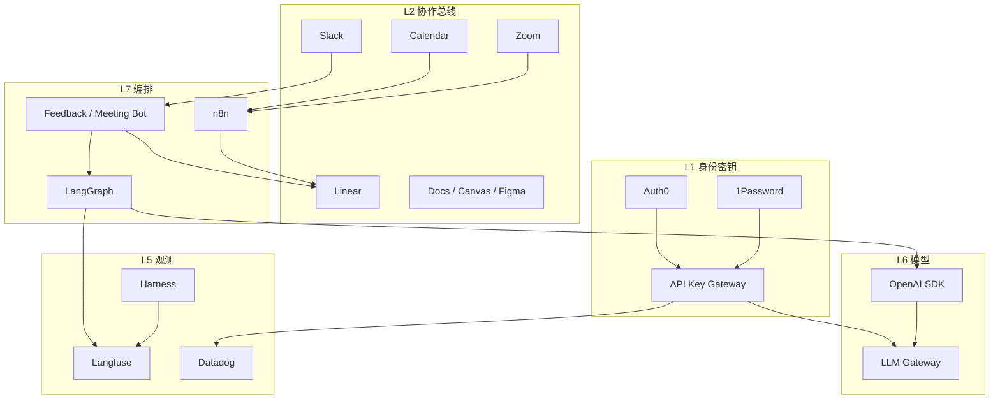

# 01 · 架构与工具地图

目标：把「人找信息、人记事、人查数、人埋点」变成「上下文自动流入 → Agent 可执行 → 结果可观测 → 知识可复用」。装插件不等于 AI Native；缺身份、密钥、审计、评测时，生成越多债越多。

---

## 1. 九层架构

```text
┌────────────────────────────────────────────────────────────────────┐
│ L8 体验入口                                                         │
│   Slack Bot · Claude · Codex · Cursor · Replit · 产品内 Copilot    │
├────────────────────────────────────────────────────────────────────┤
│ L7 编排                                                             │
│   LangGraph（有状态 Agent）· n8n（系统胶水）· Calendar 触发         │
├────────────────────────────────────────────────────────────────────┤
│ L6 模型运行时                                                       │
│   OpenAI SDK（统一客户端）· LLM / API Key Gateway · Prompt 注册    │
├────────────────────────────────────────────────────────────────────┤
│ L5 评测与观测                                                       │
│   Langfuse · Eval Harness · Datadog · Metabase                     │
├────────────────────────────────────────────────────────────────────┤
│ L4 执行与交付                                                       │
│   Codex/CI · Feature Flag / Darklight · Content 发布门禁           │
├────────────────────────────────────────────────────────────────────┤
│ L3 数据与内容                                                       │
│   Data Lake · Algolia · Metabase · Contentful                      │
├────────────────────────────────────────────────────────────────────┤
│ L2 知识与协作总线                                                   │
│   Zoom · Google Docs/Canvas · Figma · Slack · Calendar · Linear    │
├────────────────────────────────────────────────────────────────────┤
│ L1 身份与密钥                                                       │
│   Auth0 · 1Password · API Key Gateway · SSO / RBAC / M2M           │
├────────────────────────────────────────────────────────────────────┤
│ L0 审计与合规                                                       │
│   Audit Log · Policy（允许/拒绝/人审）· Retention · 红队抽检       │
└────────────────────────────────────────────────────────────────────┘
  横切：
    Sales     Salesforce
    People    Rippling · PandaDoc
    Support   Front · Aircall
    EngOps    GitHub · Incident / Oncall
```

信息自下而上受控：没有 L0/L1，上层 Agent 不该开写权限。



---

## 2. 核心原则

1. **先通信息总线，再追更强模型。** 瓶颈通常是上下文到不了决策现场。
2. **先打通高频路径。** 反馈→评估→Linear；会议→Action；Spec→PR→观测。
3. **Secrets / Endpoint / Auth 是契约。** 没进目录的能力，对 Agent 不可见。
4. **可观测 + 可审计 + 可评测。** 没有 Trace / Audit / Harness，不要扩大写权限。
5. **人机门禁写在默认路径上。** 对外发送、发布、删改、高敏感、迁移、鉴权：默认先问人。
6. **一种职责一个真相源。** Linear 管要不要做；GitHub PR 管能不能合；Docs 管决策记录。

---

## 3. L0–L1：身份、密钥、审计、网关

### 3.1 Auth0

| 主体 | 用法 |
|------|------|
| 员工 | Google Workspace / SSO → 内部工具、Replit、Bot Admin |
| 客户 | 产品登录（如需要） |
| Agent / Bot | Machine-to-Machine（M2M）+ 窄 scope |
| 服务 | Client Credentials；token 短时、可吊销 |

规则：

- 人用交互登录；Agent 只用 M2M。
- Scope 与 Endpoint Catalog 的 `access_level` 对齐（如 `metrics:read`、`issues:write`）。
- Auth0 Actions：生产 `publish` scope 不发给「闲聊就能调」的应用。

### 3.2 1Password + 运行时 Secret

- 厂商原始 key、DB 密码、Auth0 secret 只进保险库。
- 本地 / staging / prod 分库或分环境注入。
- 禁止在 Slack、文档、Replit 明文里贴 `OPENAI_API_KEY`。

### 3.3 API Key Gateway（统一管理）

问题：模型与 SaaS key 散落在 Replit、CI、个人 `.env`，无法吊销与计费。

```text
1Password（真相源）
    → 同步 / 注入
Key Gateway（唯一运行时出口）
    → 短时凭证或代理转发
LangGraph · n8n · Replit · CI · Slack Bot · 产品 Copilot 后端
```

Gateway 至少具备：

1. 按 `env × team × agent` 发逻辑 key（不是厂商原始 key）
2. 代理 OpenAI-compatible API（统一 baseURL）
3. 配额、速率、模型白名单
4. 全量审计（谁、哪个 agent、哪个模型、token、成本）
5. 紧急吊销与轮换（保险库轮换 → Gateway 热更新）

应用侧统一用 **OpenAI SDK** 指向公司网关：

```ts
import OpenAI from "openai";

const client = new OpenAI({
  apiKey: process.env.COMPANY_GATEWAY_KEY, // 公司逻辑 key
  baseURL: "https://llm-gateway.company.internal/v1",
});
```

### 3.4 Audit

最少事件字段：

```yaml
AuditEvent:
  ts: datetime
  actor_type: human | agent | bot | system
  actor_id: string
  auth0_sub: string
  action: tool.call | llm.complete | issue.create | secret.resolve | content.publish
  resource: string
  agent_name: optional
  trace_id: langfuse_trace_id
  decision: allow | deny | hitl_required
  pii_touched: boolean
  meta: object
```

去向：Datadog Logs / Lake；异常进 `#security-alerts`。Agent **不能删除**审计。

### 3.5 Policy

允许 / 拒绝 / 要求人审（HITL）。默认 HITL：CMS publish、PandaDoc send、CRM 关单与改价、生产数据删除、高 PII 外传。

---

## 4. L2：知识与协作总线

| 工具 | 职责 | 和 Agent 的关系 |
|------|------|-----------------|
| **Claude**（+ Canvas） | 需求结构化、Spec / PRD、评审包 | 输出固定章节，链到 Linear |
| **Zoom** | 会议录音与转写 | n8n 拉取 → Meeting Scribe |
| **Google Docs / Suite** | PRD、ADR、Runbook、一页纸 | 决策卡与任务回链 |
| **Figma** | 设计意图与标注 | `ready for eng` 可触发拆任务 |
| **Google Calendar** | 会前/会后/迭代节奏触发 | T-30min Brief；Cycle 边界摘要 |
| **Slack** | 协作、`#feedback`、事故、Bot 入口 | 反馈评估、简报、指标问答 |
| **Linear** | 执行队列唯一产品真相 | 自动建单、Cycle、标签约定 |
| **GitHub** | 代码、Prompt、Harness、ADR | PR、CI、Codex |

工程是否合并以 **GitHub PR** 为准；要不要做、谁做、做到哪以 **Linear** 为准。会议纪要不是第三套待办本。

---

## 5. L3：数据、检索、内容

| 工具 | 职责 | Agent 规则 |
|------|------|------------|
| **Data Lake** | 原始与治理数据 | 默认不直连 Bronze；经语义层 |
| **Algolia** | 低延迟检索、反馈/文档去重、RAG | 写入用管道账号 |
| **Metabase** | 看板与受控 SQL（Gold Collection） | 只跑已审问题；答案带 question_id |
| **Contentful** | CMS | AI 只 draft；publish 人审 |
| **Darklight** | 内容/实验态、与发布门禁绑定 | 与 Feature Flag 策略对齐 |

PM 在 **Replit** 沙箱里调试 Agent 时：Secrets 只放 `COMPANY_GATEWAY_KEY` + Auth0 M2M；Endpoint 白名单来自公司 Catalog JSON，禁止私自加生产写接口。

---

## 6. L4–L7：交付、模型、编排

| 工具 | 职责 |
|------|------|
| **Codex** / Cursor / Claude Coding | 编码 Agent；读仓库规则交活 |
| **GitHub Actions** | CI、密钥扫描、Harness gate |
| **Feature Flag / Darklight** | 灰度；Copilot 可一键关 |
| **OpenAI SDK** | 全公司统一模型客户端 |
| **LLM Gateway**（可与 Key Gateway 合一） | 路由、限流、计费、兼容层 |
| **LangGraph** | 有状态多步 Agent（反馈评估、会议抽取） |
| **n8n** | Zoom/Calendar/Slack/Linear/CRM 胶水 |
| **Replit** | PM 沙箱：Secrets + Endpoint 白名单 |

产品内 Copilot 常用流式对话 SDK（与组织侧 LangGraph 分开）：用户请求 → 应用 API → Gateway → 工具走业务授权，不直连超级账号。

---

## 7. L5：Langfuse、Harness、Datadog

| 组件 | 做什么 | 不做什么 |
|------|--------|----------|
| **Langfuse** | Trace、Prompt 版本、人工分、Dataset、成本线索 | 替代 CI 门禁 |
| **Eval Harness** | 可重复跑的金标集；PR 门禁；在线抽检 | 只当仪表盘看一眼 |
| **Datadog** | APM、RUM、业务埋点、告警、对照 AC | 代替产品分析结论的唯一来源 |
| **Metabase** | 组织与业务指标 | Agent 自由 SQL |

Harness ≠ Langfuse。改 prompt / Agent 图 / 分类阈值：必须跑 Harness；分数不达标禁止标 prod。

---

## 8. 横切：Sales / People / Support

| 团队 | 工具 | AI Native 用法 |
|------|------|----------------|
| **Sales** | **Salesforce** | 会前 Brief；赢/丢单原因结构化；产品缺口进 `#feedback`→Linear；默认只读，关单/改价人审 |
| **People** | **Rippling** | 入职开通 SSO/Slack/Git/保险库分组；离职吊销 Gateway 逻辑 key 与 M2M；组织变更同步用户组 |
| **People / Legal / Sales** | **PandaDoc** | Offer/NDA/MSA 草稿与条款 diff；send/void 人审；完成后回写 SF 或 Rippling |
| **CS** | **Front** | 工单摘要；回复草稿；标签 `product-bug` 进反馈管道 |
| **CS / Sales** | **Aircall** | 通话转写脱敏；可回流反馈或 SF Note（人审） |

```text
Rippling 入职 → 身份与权限总线 → 才能用 Slack Bot / MCP / Gateway
Salesforce 机会变更 → n8n → 会前材料 / 风险 Issue / 反馈候选
PandaDoc 签署完成 → 回写 SF 或 Rippling → Audit
Front / Aircall → 摘要 → 与反馈同一套分类管道
```

---

## 9. Endpoint Catalog（能力契约）

每个允许 Agent 调用的能力登记一行：

| 字段 | 说明 |
|------|------|
| `endpoint_id` | 稳定 ID |
| `system` | linear / slack / metabase / salesforce / … |
| `method_path` 或 MCP tool | 调用面 |
| `auth` | Auth0 scope 或 Gateway policy |
| `secret_ref` | 1Password / Gateway 逻辑名 |
| `access_level` | read / draft_write / publish / admin |
| `pii_class` | none / low / high |
| `allowed_agents` | 白名单 |
| `rate_limit` | QPS / day |
| `owner` | 负责人 |
| `runbook` | 故障与回滚 |

**没进 Catalog = Agent 不可见。** PM 在 Replit 里也只能看到 Catalog 白名单。

---

## 10. 角色 × 默认入口

| 角色 | 默认入口 | 必须会 | 禁止 |
|------|----------|--------|------|
| PM | Claude + Replit + Linear | Spec 模板、Endpoint、反馈优先级 | 生产 key 进 Doc |
| Design | Figma + Claude | 可被实现的状态/空态约束 | 无状态机的纯视觉稿当唯一需求 |
| Eng | Codex + 仓库规则 + Harness | 工具 schema、门禁、埋点 | 无 Trace 上生产 Agent |
| Data | Metabase + Lake | Gold 语义层 | Agent 任意写 SQL |
| Ops/CS | Front + Slack Bot | 升级规则、HITL | 自动对外发送 |
| Sales | Salesforce + Slack Bot | 会前 Brief、缺口回流 | 自动改关单/金额 |
| People | Rippling + PandaDoc | 入离职自动化、文件草稿 | 自动发薪/自动发正式 Offer |
| Security | Auth0 + Audit + Gateway | 轮换、scope、抽检 | 长期上帝密钥 |
| Leadership | 周报 / 双周报 Bot | 组织层指标 | 用聊天替代 Linear |

---

## 11. 安全红线

1. 厂商原始 API Key 只在 1Password → 仅 Gateway / CI 注入。
2. 应用只持公司逻辑 Key（可吊销、有配额）。
3. 高 PII / publish / 对外发送：默认 HITL。
4. 数字结论必须带 Metabase Question / Doc / Linear ID。
5. Prompt、Agent、Harness、策略全部进 Git。
6. 审计日志不可由 Agent 删除。
7. 迁移、鉴权、计费、权限模型、部署脚本：Agent 先问后人改（详见 [04-AGENTS-RUNTIME.md](./04-AGENTS-RUNTIME.md)）。

下一篇：[02-WORKFLOWS.md](./02-WORKFLOWS.md)
