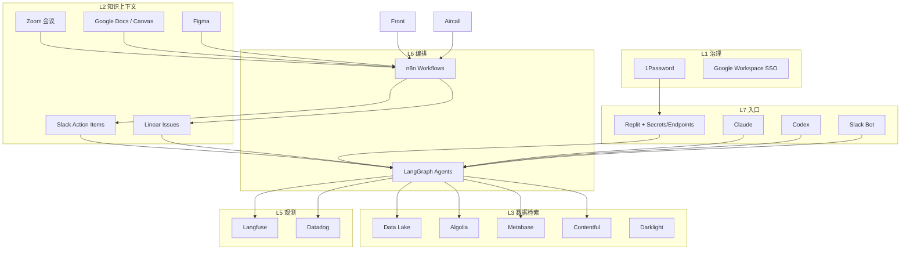

# AI Native 组织基建体系

> 目标：把「人写文档 → 人转发 → 人记事 → 人查数 → 人埋点」升级为「上下文自动流入 → Agent 可执行 → 结果可观测 → 知识可复用」的闭环，让团队以 AI 为默认协作界面。

本文基于现有工具链（Claude / Zoom / Canvas / Figma / Google Docs / Slack / Linear / Replit / Metabase / Data Lake / Algolia / Contentful / Darklight / Datadog / LangGraph / Langfuse / n8n / 1Password / Front / Aircall / Codex / Google Suite）整理，给出可落地的分层架构、核心闭环、角色模型与演进路径。

---

## 1. 什么叫 AI Native 组织

不是「每人多装几个 AI 插件」，而是组织满足以下条件：

| 维度 | 传统数字化 | AI Native |
|------|-----------|-----------|
| 工作入口 | 人打开工具找信息 | Agent / Skill 带着上下文找你 |
| 知识形态 | 散落的 Doc / 会议 / 聊天 | 可检索、可引用、可冲突追溯的知识层 |
| 需求流转 | 会议 → 人工纪要 → 手动建单 | 录音/文档 → Action Item → Linear Issue 自动生成 |
| 交付方式 | 人写代码为主 | 人定义约束，AI（Claude/Codex）在沙箱与 Secrets 下执行 |
| 数据使用 | 人写 SQL / 找看板 | Agent 经 Metabase / Lake / Algolia 受控查询 |
| 质量保障 | 上线后看日志 | Prompt/Agent 版本化 + Langfuse 评测 + Datadog 业务埋点 |
| 协作语言 | 口头约定 | 统一 Schema：Scenario / Role / Input / Output / Constraint / Benchmark |

核心原则（与既有产品思考一致）：

1. **Information Bus 优先**：瓶颈是组织内信息流动，不是再找一个更强的模型。
2. **先打通高频关键路径**：不要一上来铺全工具矩阵；先固化「需求→任务→实现→观测」最短路径。
3. **AI Feature Spec 可机器读**：每个 Agent 的 input / output / config / prompt / constraint / benchmark / status / version 必须结构化。
4. **Secrets 与 Endpoint 是契约**：PM 在 Replit 告诉 AI「能调什么」，比给一堆自然语言权限更安全。
5. **可观测 > 可生成**：没有 Langfuse / Datadog / 评测集，生成越多技术债越多。

---

## 2. 总体架构（七层）

```text
┌─────────────────────────────────────────────────────────────┐
│ L7 体验与入口层  Claude · Codex · Replit · Slack Bot · Cursor │
├─────────────────────────────────────────────────────────────┤
│ L6 编排与工作流层  LangGraph · n8n · 定时/事件触发             │
├─────────────────────────────────────────────────────────────┤
│ L5 评测与观测层  Langfuse · Datadog · Metabase 看板           │
├─────────────────────────────────────────────────────────────┤
│ L4 执行与交付层  Codex/Claude Coding · CI · Feature Flag      │
├─────────────────────────────────────────────────────────────┤
│ L3 数据与检索层  Data Lake · Algolia · Metabase · Contentful  │
├─────────────────────────────────────────────────────────────┤
│ L2 知识与上下文层  Zoom·Docs·Figma·Canvas → Slack/Linear 同步   │
├─────────────────────────────────────────────────────────────┤
│ L1 身份、密钥与治理层  1Password · SSO · RBAC · Audit           │
└─────────────────────────────────────────────────────────────┘
         ↕ 横切：Front / Aircall（客户信号）· Google Suite（协作）
```



---

## 3. 工具地图：现有栈如何各司其职

### 3.1 L1 身份、密钥与治理

| 工具 | 职责 | AI Native 用法 |
|------|------|----------------|
| **1Password** | 密钥唯一真相源 | Vault 按环境（dev/staging/prod）与角色分库；禁止把 key 写进 Doc/Slack |
| **Google Suite** | 身份与协作底座 | Workspace 账号作为 SSO；Drive 文档作为知识源而非密钥容器 |
| **权限模型** | RBAC + 最小权限 | Agent 只能通过「命名 Endpoint + Scoped Secret」访问系统，不发上帝密钥 |

**落地规范**

- Secret 命名：`ENV_SERVICE_PURPOSE`（如 `PROD_METABASE_READONLY`）
- Endpoint 注册表（见 §6）：每个可被 AI 调用的接口写清 method / auth / rate / PII 等级
- 人类与 Agent 共用同一审计通道：谁在何时用了哪个 secret 调了哪个 endpoint

### 3.2 L2 知识与上下文（Information Bus）

这是 AI Native 组织的「神经系统」。

| 来源 | 工具 | 进入总线后的产物 |
|------|------|------------------|
| 需求澄清 | Claude 整理 PRD / AC | 结构化需求包（Problem / User / AC / Out-of-scope） |
| 会议 | Zoom 录音 + 转写 | 决策、风险、Action Item |
| 设计 | Figma + Canvas | 组件意图、交互约束、设计 token 引用 |
| 文档 | Google Docs | 版本化 Spec、ADR、运行手册 |
| 协作分发 | Slack | 频道内 Action Item、@owner、截止时间 |
| 执行跟踪 | Linear | Issue / Project / Cycle，状态机唯一 |

**推荐同步链路（n8n）**

```text
Zoom 结束 / Docs 更新 / Figma comment
        ↓
  n8n：解析 → 抽取决策与待办 → 去重
        ↓
  ┌─────┴─────┐
  Slack 通知    Linear Issue（带链接回源）
  （频道+@人）   （label: from-meeting / from-doc）
```

**知识对象最小 Schema**

```yaml
KnowledgeItem:
  id: uuid
  source_type: zoom | gdoc | figma | canvas | slack | claude
  source_url: string
  title: string
  decisions: [string]
  action_items:
    - owner: email
      text: string
      due: date
      linear_id: optional
  entities: [product | customer | system]
  embedding_ref: algolia_or_vector_id
  updated_at: datetime
```

### 3.3 L3 数据与检索

| 工具 | 职责 | Agent 如何用 |
|------|------|--------------|
| **Data Lake** | 原始事件、业务事实、历史快照 | 只读分析 Endpoint；禁止 Agent 直接写生产湖 |
| **Algolia** | 产品/内容/知识的低延迟检索 | 语义+关键词混合检索；作为 RAG 第一跳 |
| **Metabase** | 受控 SQL / 看板 / 问题目录 | Agent 优先调用「已保存 Question / Model」，禁止随意自由 SQL（除非只读沙箱） |
| **Contentful** | 内容 CMS | 内容起草、本地化、发布门禁 |
| **Darklight** | 内容/实验/暗亮态相关运营面（与 Contentful 并列） | 与发布、实验或内容态切换绑定；变更需可回溯 |

**数据分层约定**

```text
Bronze（Lake 原始） → Silver（清洗可分析） → Gold（Metabase Model / 指标）
                                              ↘ Algolia Index（面向检索与 Agent）
```

Agent 默认只碰 Gold + Algolia；需要下钻时走审批或只读 Metabase Question。

### 3.4 L4 执行与交付

| 角色/工具 | 职责 |
|-----------|------|
| **Claude** | 需求结构化、Spec、评审材料、复杂推理 |
| **Codex** | 仓库内编码、测试、小型重构 |
| **Replit（PM）** | 原型 / 编排沙箱；通过 Secrets + Endpoint 告诉 AI 可调接口 |
| **CI / Review** | 人机共审：AI 出 Diff，人把关架构与风险 |
| **Feature Flag / Darklight** | 灰度与实验，避免 AI 变更一次全量 |

**PM Replit 工作模式（关键）**

```text
Secrets（1Password 注入）
  + Endpoint Catalog（OpenAPI / 内部清单）
  + Prompt / Skill
  = 可重复的「产品侧 Agent 运行时」
```

PM 不需要把整库权限给模型，只需声明：

- 可读：`GET /metrics/weekly`, Metabase Q#128
- 可写：`POST /content/draft`（仅 draft）
- 禁止：支付、删库、生产 Contentful publish（需人点确认）

### 3.5 L5 评测与观测

| 工具 | 观测对象 |
|------|----------|
| **Langfuse** | Prompt / Trace / Span / 成本 / 延迟 / 人工打分 / 数据集回归 |
| **Datadog** | 应用 APM、前端 RUM、自定义业务埋点、告警 |
| **Metabase** | 产品指标与 Agent 业务结果（转化、解决率、人工接管率） |

**三层指标**

1. **模型层**：token、延迟、错误率、tool 失败率（Langfuse）
2. **产品层**：任务完成率、CSAT、二次联系率（Datadog + Front/Aircall）
3. **组织层**：需求→Linear 自动率、Action Item 按时关闭率、知识引用命中率

建议节奏：每两周一次 **Prompt / Agent Review**（对照 bad case 表），与发版节奏解耦。

### 3.6 L6 编排与工作流

| 工具 | 适合场景 |
|------|----------|
| **n8n** | 系统集成、Webhook、定时同步、通知、CRUD 胶水（Zoom→Slack→Linear） |
| **LangGraph** | 多步推理、带状态的 Agent、工具调用图、人机门禁节点（human-in-the-loop） |

**分工口诀**

- 「把 A 系统的事件变成 B 系统的记录」→ **n8n**
- 「根据上下文决定下一步调哪个工具并保持记忆」→ **LangGraph**
- 两者交界：n8n 触发 LangGraph 工作流；LangGraph 回调 n8n 发 Slack / 建 Linear

### 3.7 L7 体验与入口

统一入口策略（避免工具碎片化）：

| 入口 | 谁用 | 典型意图 |
|------|------|----------|
| Slack Bot | 全员 | 查决策、建 Issue、跑只读查询、触发工作流 |
| Claude / Cursor / Codex | 产研 | Spec、编码、重构、评审 |
| Replit | PM | 原型、接口联调、演示 Agent |
| Front / Aircall 侧边 | 客服/增长 | 客户上下文摘要、跟进草稿 |

**单一上下文原则**：同一问题在 Slack 问过，Agent 应能引用 Linear / Doc / 会议同一条知识 ID，而不是重新「猜」。

### 3.8 横切：客户与沟通信号

| 工具 | 进入 AI 体系的方式 |
|------|-------------------|
| **Front** | 工单/邮件 → 摘要 → 标签 → 可选建 Linear bug；回复草稿经人确认 |
| **Aircall** | 通话转写 → 痛点抽取 → CRM/知识库；高频问题回流 Contentful FAQ |
| **Google Suite** | Calendar 驱动会前简报；Drive 为知识源；Sheets 作轻量评测表 |

---

## 4. 四条组织级闭环（必须全部跑通）

### 闭环 A：会议 → 行动（协作闭环）

```text
Zoom 结束
  → 转写 + Claude 结构化
  → n8n 同步 Slack Action Item + Linear Issue
  → Owner 在 Linear 关闭
  → 周会 Bot 汇总逾期与阻塞
```

成功标准：≥70% 的会后待办无需人工复制粘贴。

### 闭环 B：需求 → 交付（建造闭环）

```text
Claude 需求包（含 AC）
  → Figma / Canvas 设计约束
  → Linear Issue 自动挂载 Spec 链接
  → Codex/Claude 实现 + 测试
  → Review + Flag 发布
  → Datadog 埋点验证 AC
```

成功标准：每个 Issue 都能追溯到 Spec / 会议 / 设计源。

### 闭环 C：数据 → 决策（洞察闭环）

```text
埋点 / Lake 事件
  → Metabase Model
  → 人问 Slack Bot 或 Replit Agent
  → 受控查询 + 引用 Question ID
  → 结论写回 Docs / Linear
```

成功标准：关键指标回答必须带来源（Question / 查询 ID），禁止「模型口算」。

### 闭环 D：Agent → 改进（智能闭环）

```text
线上 Trace（Langfuse）
  → Bad case 入库
  → 评测集回归
  → Prompt/Graph 版本 bump
  → 灰度（Darklight / Flag）
  → 效果对比看板
```

成功标准：Prompt 变更像代码一样有版本、有 diff、有回滚。

---

## 5. 角色 × AI 能力矩阵

| 角色 | 默认 AI 入口 | 必须掌握 | 禁止 |
|------|-------------|---------|------|
| **PM** | Claude + Replit + Linear | AI Feature Spec、Endpoint 契约、Metabase Question | 生产密钥进 Doc；无 AC 就开 Agent |
| **Design** | Figma + Claude | 设计意图结构化、组件约束可被编码消费 | 只出视觉不写交互状态机 |
| **Eng** | Codex/Claude + LangGraph | Tool schema、评测、可观测埋点 | 无 Trace 的 Agent 上生产 |
| **Data** | Metabase + Lake | Gold 层指标口径、Agent 可用语义层 | 给 Agent 开放任意 SQL 写权限 |
| **Ops / CS** | Front + Slack Bot | 客户摘要、升级规则 | 未经确认的自动外发回复 |
| **领导层** | Slack 周报 Bot | 看组织层指标与风险 | 用聊天记录替代 Linear 状态 |

**AI Feature Spec 模板（每个 Agent 一份）**

```yaml
agent:
  name: weekly-metric-copilot
  owner: pm@company
  version: 1.4.0
  scenario: 周会前自动生成核心指标摘要
  role: 只读数据分析助手
  input:
    - cycle_id
    - metric_pack: growth_core
  tools:
    - metabase.question:128
    - metabase.question:245
    - linear.list_issues
  output:
    format: slack_mrkdwn
    must_include: [source_question_ids, anomalies, risks]
  constraints:
    - no_raw_pii
    - no_write_tools
  benchmark:
    dataset: langfuse/datasets/weekly-summary-v3
    pass_threshold: 0.85
  status: production
```

---

## 6. Endpoint Catalog（AI 可调用接口契约）

集中维护一份目录（Google Sheet 或内部 repo），Replit / LangGraph / n8n 都引用同一份。

| 字段 | 说明 |
|------|------|
| `endpoint_id` | 稳定 ID |
| `system` | metabase / contentful / linear / algolia / ... |
| `method_path` | `GET /api/...` |
| `auth_secret_ref` | 1Password 引用名 |
| `access_level` | read / draft_write / publish / admin |
| `pii_class` | none / low / high |
| `allowed_agents` | agent name 列表 |
| `rate_limit` | QPS / day |
| `owner` | 人对人负责 |
| `runbook` | 故障与撤销说明 |

没有进入 Catalog 的接口，默认 **Agent 不可见**。

---

## 7. 参考技术拓扑（目标态）

```text
[人] ── Slack / Claude / Replit / IDE
          │
          ▼
   Gateway（鉴权 · 配额 · 审计 · 策略）
          │
     ┌────┴────┐
     ▼         ▼
   n8n      LangGraph
  (集成)     (推理/工具)
     │         │
     ├─────────┼──────────┐
     ▼         ▼          ▼
  Linear    Metabase    Contentful
  Slack     Algolia     Darklight
  Docs      Data Lake   Front/Aircall
     │         │
     └────┬────┘
          ▼
   Langfuse ←── traces / scores
   Datadog  ←── product events / APM
```

**Gateway 最小能力**

1. 身份：Google SSO / Bot token → 内部 subject
2. 策略：按 agent × endpoint × 环境放行
3. 审计：请求、工具调用、密钥别名（非明文）落日志
4. 预算：按团队/Agent 的 token 与外部 API 成本限额

早期可用 n8n + 约定 Header 近似实现；成熟后收口为统一 API Gateway / MCP Server 集群。

---

## 8. MCP / Skill 化方向（从「人点工具」到「模型调能力」）

中长期把高频能力封装为 **Skill / MCP**：

| MCP / Skill | 背后系统 |
|-------------|----------|
| `meeting.sync` | Zoom → Slack/Linear |
| `specs.read` | Google Docs / Claude Canvas 导出 |
| `design.constraints` | Figma |
| `issues.*` | Linear |
| `metrics.query` | Metabase Gold |
| `search.knowledge` | Algolia + 知识层 |
| `content.draft` | Contentful |
| `support.summarize` | Front / Aircall |
| `secrets.resolve` | 1Password（仅服务端） |
| `obs.trace` | Langfuse / Datadog |

这样 Claude / Codex / 内部 Bot 共用同一能力面，避免每个入口各写一套集成。

---

## 9. 安全、合规与质量红线

1. **密钥**：只在 1Password → 运行时注入；Chat/Doc/Figma 发现疑似密钥立即轮换。
2. **PII**：客服与通话类默认脱敏；高 PII endpoint 需双人审批才进 Catalog。
3. **写出路径**：publish / 删改 / 对外发送默认 human-in-the-loop。
4. **幻觉控制**：凡涉及数字与承诺，必须引用 Metabase Question / Doc 段落 / Linear ID。
5. **模型产出入库**：代码与 Prompt 进 Git；知识结论进 Docs 并带来源；禁止「只活在聊天里的决策」。
6. **成本**：Langfuse 按 Agent 看成本；异常飙升自动告警到 Slack。

---

## 10. 演进路线（按能力，不按日历）

### Stage 0 — 对齐（已有工具可用）

- 清点账号、频道、Linear teams、Metabase Collection
- 1Password 分库；停用聊天传密钥
- 约定 Action Item / Issue 字段标准

### Stage 1 — Information Bus

- n8n：Zoom/Docs → Slack + Linear
- Algolia（或向量库）索引 Spec / 会议决策
- Slack Bot：查「某决策从哪来」

### Stage 2 — 受控数据 Agent

- Endpoint Catalog v1
- Replit PM 沙箱只读接 Metabase / Algolia
- Langfuse 接到所有 Agent trace

### Stage 3 — 生产级 Agent 运行时

- LangGraph 多 Agent（研究 / 编码 / 客服摘要）
- Datadog 业务埋点与 Agent 结果对齐
- 双周 Prompt Review + 评测集门禁

### Stage 4 — 组织操作系统

- 统一 Gateway / MCP
- 组织层看板：自动建单率、知识命中率、Agent 解决率、人工接管率
- 新员工 onboarding = 授予 Skills，而不是发 20 个账号说明

每阶段只扩「已证明高频」的路径；低频场景保持人工。

---

## 11. 团队仪式（让基建产生文化）

| 仪式 | 频率 | 内容 |
|------|------|------|
| AI Standup | 每日 | 阻塞是否缺上下文 / 缺 endpoint，而非只报人日 |
| Prompt Review | 双周 | Bad case、版本 diff、是否达标 |
| Catalog Office Hour | 双周 | 新增/下线 AI 可调用接口 |
| Knowledge Gardening | 每周 | 清理过期 Docs、合并冲突决策、补 Algolia |
| Game Day | 每季 | 密钥泄露演练、Agent 误写回滚、供应商故障 |

---

## 12. 90 天能力检查清单

- [ ] 会议 Action Item 自动进 Slack + Linear，并可回链到录音/纪要
- [ ] 任意 Linear Issue 能打开对应 Spec / Figma / 会议来源
- [ ] PM 可在 Replit 用 Secrets+Endpoint 跑通一条只读分析 Agent
- [ ] 所有生产 Agent 有 Langfuse 项目与版本号
- [ ] 关键用户路径有 Datadog 埋点，并可对照 AC
- [ ] Metabase 有 Gold「语义层」Collection，供 Agent 专用
- [ ] Contentful（及 Darklight）发布需人确认；草稿可由 Agent 生成
- [ ] Front/Aircall 高频问题每周回流 FAQ / 需求池
- [ ] 1Password 之外无长期有效生产密钥副本
- [ ] 新成员第 1 周能用 Slack Bot 完成：查决策、建 Issue、拉周报指标

---

## 13. 一页纸：我们如何工作

```text
想清楚（Claude Spec）
  → 说清楚（Zoom / Docs / Figma）
  → 流进去（n8n → Slack / Linear）
  → 查得到（Algolia / 知识层）
  → 算得准（Metabase / Lake）
  → 做得动（Codex / LangGraph / Replit）
  → 看得见（Langfuse / Datadog）
  → 守得住（1Password / Catalog / HITL）
  → 听得到（Front / Aircall → 回流）
```

当这九步对团队是默认路径而不是「先进同学的个人技巧」时，组织即完成向 AI Native 的进化。

---

## 附录 A：现有工具 → 层级速查

| 工具 | 层级 | 主角色 |
|------|------|--------|
| 1Password | L1 | 密钥治理 |
| Google Suite | L1/L2 | 身份 + 文档协作 |
| Zoom | L2 | 会议上下文 |
| Claude / Canvas | L2/L7 | 需求与创作入口 |
| Figma | L2 | 设计上下文 |
| Google Docs | L2 | Spec / ADR |
| Slack | L2/L7 | Action Item + Bot 入口 |
| Linear | L2/L4 | 执行真相源 |
| Data Lake | L3 | 事实存储 |
| Algolia | L3 | 检索 / RAG |
| Metabase | L3/L5 | 语义查询 + 分析 |
| Contentful | L3/L4 | 内容生产 |
| Darklight | L3/L4 | 内容/实验态 |
| Replit | L7/L4 | PM Agent 沙箱 |
| Codex | L4/L7 | 编码执行 |
| LangGraph | L6 | Agent 编排 |
| n8n | L6 | 系统工作流 |
| Langfuse | L5 | LLM 可观测与评测 |
| Datadog | L5 | 产品与系统监测 |
| Front | 横切 | 邮件/工单信号 |
| Aircall | 横切 | 通话信号 |

## 附录 B：相关内部思考锚点

- 组织瓶颈在信息流动与同一上下文（Information Bus），而非单点模型能力。
- Agent 开发需要完整的 AI Feature Spec，而不是口头「让 AI 做一下」。
- 用 n8n 做 workflow、Langfuse 做版本与评测、Slack Bot 做验证，是已验证的轻量组合。
- 产品建设应先打通最短高频关键路径，再扩展复杂交互。

---

*文档维护：随 Endpoint Catalog 与 Agent 清单变更而更新。建议放在团队 Docs 首页，并在 Algolia 知识索引中置顶。*
