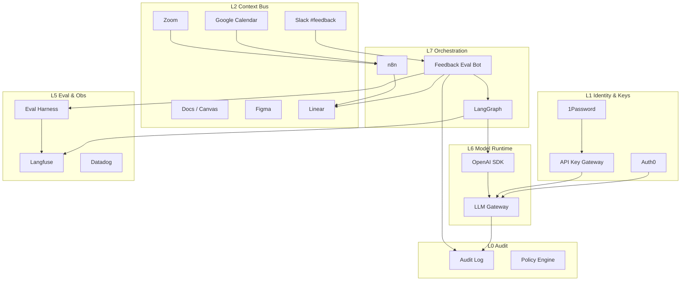

# AI Native 组织基建体系

这套东西要解决的不是「再装一个更强的模型」，而是：上下文怎么进场、Agent 能做什么、结果能不能复查、改完业务规则有没有写回文档。

对照过 crimson-app 的 `AGENTS.md` / `README` 之后，全文默认两套状态：

- **现场（as-is）**：仓库里已经在约束编码 Agent、产品 Copilot 已经在跑。
- **目标（to-be）**：组织级反馈总线、统一 Key Gateway、日历驱动的会议入库。还没被这份 codebase 证实的，不当成已上线。

对照明细见 [REFLECTION.md](./REFLECTION.md)。

**配套文档**

| 文档 | 用途 |
|------|------|
| [WORKFLOWS.md](./WORKFLOWS.md) | 端到端工作流（编码交付环是现场；Slack→任务是目标） |
| [SKILLS-MCP-PLUGINS.md](./SKILLS-MCP-PLUGINS.md) | Skill / MCP / Plugin：仓库 Skill 是现场，公司 MCP 总线是目标 |
| [TOOLKIT-CHECKLIST.md](./TOOLKIT-CHECKLIST.md) | 给其他团队复制的工具清单 |
| [ORG-OPERATING-CADENCE.md](./ORG-OPERATING-CADENCE.md) | 人的会议节奏怎么接工具 |

---

## 1. 什么叫 AI Native 组织

不是「每人多装几个 AI 插件」，而是组织满足以下条件：

| 维度 | 传统数字化 | AI Native |
|------|-----------|-----------|
| 工作入口 | 人打开工具找信息 | Agent / Skill 带着上下文找你 |
| 知识形态 | 散落的 Doc / 会议 / 聊天 | 可检索、可引用、可冲突追溯的知识层 |
| 需求流转 | 会议 → 人工纪要 → 手动建单 | 信号进评估，再进任务系统（GitHub Issue/PR 或 Linear） |
| 交付方式 | 人写代码为主 | 人定义约束，AI 在沙箱与 Secrets 下执行；改行为必须改知识库 |
| 数据使用 | 人写 SQL / 找看板 | Agent 经受控语义层查询 |
| 质量保障 | 上线后看日志 | Harness 回归 + Langfuse + Datadog + Audit |
| 身份与密钥 | 各系统各管一套 | 人走 SSO；机器走短时凭证；密钥不进聊天和文档 |
| 协作语言 | 口头约定 | Scenario / Role / Input / Output / Constraint / Benchmark |

**核心原则**

1. **先通信息，再换模型。** 卡住的通常是上下文到不了现场。
2. **先打高频路径。** 现场已经能跑的是：改代码 → 验证 → 更新 `docs/` → PR。反馈进任务系统是下一步。
3. **给 Agent 的说明要分层。** 根目录管流程，workspace 管实现，组件目录管产品 Copilot。
4. **没进目录的能力，默认当不存在。** 密钥、接口、权限都要有主人。
5. **没有 Trace / 评测 / 审计，就不要扩大写权限。**
6. **对外发送、发布、删数据、高敏感信息，默认等人点头。** 迁移、鉴权、计费同样先问工程师。

---

## 2. 总体架构（九层 + 横切）

下面这张图是 **目标分层**。括号里标出现场已经对得上的部分。

```text
┌──────────────────────────────────────────────────────────────────┐
│ L8 入口     Cursor/Codex · 产品 Copilot 抽屉 · Claude · Slack*   │
├──────────────────────────────────────────────────────────────────┤
│ L7 编排     产品：Vercel AI SDK + AgentBus + GraphQL 线程        │
│             组织：n8n / LangGraph / Calendar*（目标）             │
├──────────────────────────────────────────────────────────────────┤
│ L6 模型     产品流式接口；组织侧统一 SDK + Gateway*               │
├──────────────────────────────────────────────────────────────────┤
│ L5 观测     Langfuse（产品 Agent 已用）· 评测门禁* · Datadog*    │
├──────────────────────────────────────────────────────────────────┤
│ L4 交付     GitHub PR · pr-agent · featureSwitches · e2e         │
├──────────────────────────────────────────────────────────────────┤
│ L3 数据     PostgreSQL · Contentful · Lake/分析层*               │
├──────────────────────────────────────────────────────────────────┤
│ L2 知识     仓库 docs/ + AGENTS.md + agent_log（现场）           │
│             会议/Slack/日历入库*（目标）                           │
├──────────────────────────────────────────────────────────────────┤
│ L1 密钥     1Password → local.env；prod 用 AWS Secrets Manager   │
│             统一 Key Gateway*（目标）                             │
├──────────────────────────────────────────────────────────────────┤
│ L0 纪律     高风险先问人 · 知识库同 PR 更新 · 审计/retention*    │
└──────────────────────────────────────────────────────────────────┘
  * 目标态，对照文档里未证实已落地

  横切：
    产品 Agent   学生/文档/页面上下文 · 多入口
    GTM          Salesforce（delegate 同步存在）
    EngOps       GitHub · Terraform · AWS SSO
```



---

## 3. 从公司运转视角：原先遗漏与补齐

对照「一家公司每天如何运转」，这些能力经常漏。下表把 **现场已经有影子的** 和 **仍是蓝图的** 分开。

| 能力域 | 为何必要 | 推荐落点 | 对照 |
|--------|----------|----------|------|
| **编码 Agent 操作系统** | 不规定怎么交活，Agent 会乱改范围、漏文档 | 分层 `AGENTS.md` + 知识库同 PR | **现场** |
| **业务知识库** | 改了规则却不写 docs，下次 Agent 继续猜 | `docs/business-map.md`、`domains/`、`log.md` | **现场** |
| **产品 Copilot 运行时** | 用户侧 Agent 需要上下文、线程、观测 | Vercel AI SDK + GraphQL + Langfuse | **现场** |
| **统一身份** | 人、Bot、服务账号不能混用一套长期密钥 | Auth0 + Google SSO；Agent 用短时 M2M | 人的 SSO **现场有**；Agent Catalog **目标** |
| **密钥** | key 散落就无法吊销和计费 | 现场：1Password + Secrets Manager；目标：Key Gateway | 混合 |
| **LLM Gateway** | 多模型路由、限流、成本 | LiteLLM / Portkey / 自建 | **目标** |
| **Calendar / 会议入库** | 会前简报、会后行动不要靠人粘贴 | Calendar + 转写 → 任务系统 | **目标** |
| **反馈进研发** | Slack 里的话要变成可跟踪工作 | Bot 评估 → GitHub 或 Linear | **目标** |
| **Eval Harness** | 改 prompt 要能回归 | 数据集 + CI 门禁；复杂调参先跑评测 | Skill 形态 **有**；全量 CI **目标** |
| **Audit** | 谁调了工具、碰了哪些敏感字段 | 不可删审计流 | **目标** |
| **CI/CD** | AI 写的代码走同一套检查 | GitHub + required checks + pr-agent | **现场** |
| **环境分层** | local / staging / prod 密钥隔离 | `local.env` + Secrets Manager 分 secret | **现场** |
| **Feature Flag** | Agent 功能要能关 | `featureSwitches`；不必绑定某一家 Flag 产品 | **现场** |
| **Salesforce** | GTM 数据在 CRM | `services/delegate` 同步；只读 Brief 是目标 | 同步 **现场**；Copilot **目标** |
| **CMS** | 内容发布要人审 | Contentful；AI 只 draft | 同步 **现场**；AI 发布门禁 **目标** |
| **People / 合同** | 入离职和 Offer 决定权限 | Rippling / PandaDoc 或等价物 | 对照文档 **未证实** |
| **客户支持真相源** | Front/Aircall 之外要有账号/订阅上下文 | Salesforce Account + 内部 Customer 360 只读 API | 建议 |
| **状态页 / 变更日志** | 对外与对内沟通发版 | Statuspage + Linear Releases / Changelog | 建议 |
| **设计系统可消费** | Figma token → 代码 | Tokens pipeline | 建议 |
| **向量/记忆层** | 长期记忆与会话摘要 | 向量库或 Algolia Neural + Memory MCP | 建议 |

### 3.1 Auth0（身份运行时）

| 主体 | Auth0 用法 |
|------|------------|
| 员工 | Google Workspace OIDC 登录内部工具 / Replit / Bot Admin |
| 客户 | 产品应用登录（如需要） |
| Agent / Bot | Machine-to-Machine（M2M）Application + 窄 scope |
| 服务 | Client Credentials；token 短时、可吊销 |

**规则**

- 人类用 Interactive Login；Agent 只用 M2M。
- Scope 与 Endpoint Catalog 的 `access_level` 对齐（`metrics:read`、`issues:write`…）。
- Auth0 Actions 里写：禁止生产 publish scope 发给非人工确认流。

### 3.1b 现场已经在跑的两套 Agent

**编码 Agent（给工程师）**

根 `AGENTS.md` 把交活标准写死了：改完代码、跑最小验证、业务规则变了就改 `docs/`、推分支、开 PR。默认不直提 `master`，分支用 `codex/` 前缀。高风险（迁移、鉴权、计费、共享基建）先问人。`pr-agent` 会评 PR；`agent_log/` 只记摘要，不塞聊天和密钥。

Web / API 各自还有一份 `AGENTS.md`，管框架、测试命令、模块边界。产品 Copilot 还有组件级说明。

**产品 Copilot（给学生顾问用）**

- 框架：Vercel AI SDK（`@ai-sdk/react`），不是 LangGraph。
- 状态：Zustand 两套 store（持久 UI + 运行时）。
- 入口：`default_agent`、`student_onboarding`、`ssa_copilot`。
- 上下文：学生、文档、当前页面；页面正文发送时再取，避免把敏感大段存进本地状态。
- 接口：`POST /crimson-copilot`、`POST /student-onboarding`，流式返回。
- 开关：`GLOBAL_AGENT`、`COPILOT_AGENT_UI`、`AGENT_DOCUMENT_GENERATION`。
- 观测：Langfuse + 浏览器日志。
- 页面模块和 Agent 之间用 `AgentBus` 发事件 / RPC。

组织级 Slack Bot 不要和这个 Copilot 画成同一个进程。

### 3.2 API Key 统一管理（Key Gateway）

现场做法：1Password 出库，本地写成 `local.env`；staging/prod 从 AWS Secrets Manager 拉 `crimson-app/{env}`（API 再拉 db secret）。个人覆盖用 `overrides.env`。

问题仍然在：模型厂商 key 一旦进 Replit、CI、个人 `.env` 副本，就很难统一吊销和计费。

**目标架构**

```text
1Password (真相源)
    ↓ 同步/注入
Key Gateway (唯一运行时出口)
    ↓ 签发短时凭证 / 代理转发
LangGraph · n8n · Replit · CI · Slack Bot
```

**Gateway 能力清单**

1. 按 `env × team × agent` 发放逻辑密钥（不是厂商原始 key）
2. 代理调用 OpenAI-compatible API（统一 base URL）
3. 配额、速率、模型白名单
4. 全量 Audit（谁、哪个 agent、哪个模型、token、成本）
5. 紧急吊销与轮换（1Password 轮换 → Gateway 热更新）

应用侧统一用 **OpenAI SDK**（或兼容 SDK）指向 Gateway：

```ts
import OpenAI from "openai";

const client = new OpenAI({
  apiKey: process.env.COMPANY_GATEWAY_KEY, // 公司逻辑 key
  baseURL: "https://llm-gateway.company.internal/v1",
});
```

### 3.3 Eval Harness（评测支架）

Harness ≠ Langfuse。Langfuse 负责 **记录与人工分**；Harness 负责 **可重复跑的门禁**。

| 组件 | 说明 |
|------|------|
| Dataset | 金标输入/期望输出/评分标准（存 Git 或 Langfuse Dataset） |
| Runners | 对某个 Agent/Prompt 版本批量回放 |
| Scorers | 规则分 + LLM-as-judge + 人工抽检 |
| Gate | CI：分数 < 阈值则禁止晋升 prod |
| Online Eval | 对 Slack 反馈 / 线上采样自动打分后写 Linear |

### 3.4 Audit（审计）

最少审计事件：

```yaml
AuditEvent:
  ts: datetime
  actor_type: human | agent | bot | system
  actor_id: string
  auth0_sub: string
  action: tool.call | llm.complete | issue.create | secret.resolve | content.publish
  resource: string
  agent_name: optional
  trace_id: langfuse_trace_id
  decision: allow | deny | hitl_required
  pii_touched: boolean
  meta: object
```

去向：Datadog Logs / Lake（长期）+ 异常告警到 `#security-alerts`。

### 3.5 Google Calendar

| 事件 | 自动化 |
|------|--------|
| 会议开始前 30min | Bot 推送：相关 Linear、上次决策、开放反馈 |
| 会议结束后 | 与 Zoom 转写合流 → Action Item |
| Sprint/Cycle 起止 | 自动生成进度摘要到 Slack + 更新 Linear cycle |
| Oncall 轮值 | Calendar 覆盖 → 告警路由 |

---

## 4. 工具地图

L1 的 Gateway、L7 的 n8n/LangGraph 按 **目标** 采购。现场已经能指着仓库说的，写在职责列里。

### 4.1 L0–L1 治理与身份

| 工具 | 职责 |
|------|------|
| **Auth0** | SSO、RBAC、M2M、用户/机器身份 |
| **1Password** | 密钥真相源、团队保险库 |
| **API Key Gateway** | 运行时唯一模型/SaaS 密钥出口 |
| **Audit Log** | 不可抵赖操作记录 |
| **Policy Engine** | 允许/拒绝/HITL（可先做在 Gateway + Auth0 Actions） |

### 4.2 L2 知识与上下文

| 工具 | 职责 |
|------|------|
| Claude / Canvas | 需求结构化、Spec |
| Zoom | 会议录音转写 |
| Google Docs | PRD / ADR / Runbook |
| Figma | 设计意图与约束 |
| Google Calendar | 时间触发与会前会后上下文 |
| Slack | 协作、`#feedback` 收集、Bot 入口 |
| Linear / Jira | 产品与反馈队列（目标常用 Linear；现场工程主路径是 GitHub） |
| GitHub | 代码、PR、`AGENTS.md`、Prompt、评测、ADR |

### 4.3 L3 数据与检索

| 工具 | 职责 |
|------|------|
| Data Lake | 原始/治理数据 |
| Algolia | 低延迟检索 / RAG |
| Metabase | 语义层 SQL / 看板 |
| Contentful | CMS |
| 仓库 docs/ + AGENTS.md | 给编码 Agent 的可执行知识（现场） |
| Darklight 或 Flag | 内容/实验态；现场 Web 灰度是 `featureSwitches` |
| Customer 360 API（建议） | 账号/订阅只读上下文 |

### 4.4 L4–L6 执行、模型、编排

| 工具 | 职责 |
|------|------|
| Codex / Cursor / Claude Coding | 编码 Agent |
| GitHub Actions + pr-agent | CI、PR 评语、密钥扫描 |
| featureSwitches / Flag 产品 | 灰度；现场 Web 用 `featureSwitches` |
| **OpenAI SDK** | 统一模型调用客户端 |
| **LLM Gateway** | 路由、限流、计费、兼容层 |
| 产品：Vercel AI SDK + AgentBus | 用户侧有状态对话与页面协同 |
| 组织：LangGraph / n8n | 跨系统胶水（目标） |
| Replit 或内部 Studio | PM 沙箱（可选；仓库有 SDK，不表示全员入口） |

### 4.5 L5 观测与评测

| 工具 | 职责 |
|------|------|
| Langfuse | Trace、Prompt 版本、人工分、Dataset |
| **Eval Harness** | 回归门禁、在线评估 |
| Datadog | APM、RUM、业务埋点、告警 |
| Metabase | 业务与组织指标 |

### 4.6 L8 入口与横切

| 工具 | 职责 |
|------|------|
| Slack Bot | 反馈评估、查询、建单、简报 |
| Front | 邮件/工单 |
| Aircall | 通话 |
| Incident 工具 | 故障响应 |
| Status / Changelog | 变更沟通 |

### 4.7 GTM 与 People（组织运转横切）

| 团队 | 工具 | 职责 | AI Native 用法 |
|------|------|------|----------------|
| **Sales** | **Salesforce** | CRM：Lead/Account/Opportunity/Activity | 会前 Brief、赢/丢单原因结构化、产品反馈回流 `#feedback`→Linear；Agent 默认只读，阶段变更需人确认或窄 scope |
| **People** | **Rippling** | HRIS：入离职、组织、薪酬/设备（按采购模块） | 入职自动开通 Auth0/Google/Slack/1Password/工具组；离职自动吊销 Gateway 逻辑 key 与 M2M；组织变更同步 Linear/Slack 用户组 |
| **People / GTM** | **PandaDoc** | Offer、NDA、客户合同、对外正式文件 | AI 生成草稿与条款差异摘要；发送、签署、改价默认 HITL；完成后回写 Salesforce / Rippling |

**数据流向（摘要）**

```text
Rippling 入职 → 账号与权限总线 → 才能使用 Slack Bot / MCP
Salesforce 机会变更 → n8n → 会前材料 / 风险 Linear / 反馈候选
PandaDoc 签署完成 → 回写 SF Account 或 Rippling candidate → Audit
```

---

## 5. 组织级闭环（六条）

### A. 会议 → 行动

Zoom/Calendar → 转写 → 结构化 → Slack + Linear

### B. 需求 → 交付（现场主路径）

Spec / 知识库 → GitHub 分支（`codex/`）→ 最小验证 → 更新 `docs/domains`（若改行为）→ PR → pr-agent → Flag 灰度

Linear 可以当产品队列，但不要写成工程唯一真相源。

### C. 数据 → 决策

Lake → Metabase Gold → Bot/Agent 引用 Question ID → 写回 Docs/Linear

### D. Agent → 改进

Langfuse Trace → Bad case → Harness → 版本晋升 → 灰度

### E. 反馈 → 评估 → 研发（目标主路径）

```text
用户/同事在 Slack #feedback 发帖
  → Feedback Bot 接收（线程订阅）
  → 归一化（类型/严重度/产品面/是否可复现）
  → Eval（规则 + LLM judge + 可选 Harness 抽样）
  → 决策：
      - duplicate → 挂到已有 Linear + 回复线程
      - bug/req → 创建/更新 Linear（priority、label、AC 草稿）
      - needs_info → Bot 追问
      - spam/out_of_scope → 标记并关闭
  → Audit + Langfuse trace
  → 每日摘要到 #feedback-triage
```

详见 [WORKFLOWS.md](./WORKFLOWS.md)。

### F. 身份 → 调用 → 审计（控制面闭环）

Auth0 发 token → Key Gateway 放行 → 工具调用 → Audit/Langfuse → 异常吊销

---

## 6. 角色 × AI 能力矩阵

| 角色 | 默认入口 | 必须掌握 | 禁止 |
|------|----------|----------|------|
| PM | Claude + Replit + Linear | Feature Spec、Endpoint、反馈优先级 | 生产 key 进 Doc |
| Design | Figma + Claude | 可被代码消费的约束 | 无状态机的纯视觉稿 |
| Eng | Codex + LangGraph + Harness | Tool schema、门禁、埋点 | 无 Trace 上生产 |
| Data | Metabase + Lake | Gold 语义层 | Agent 任意写 SQL |
| Ops/CS | Front + Slack Bot | 升级规则、HITL | 自动对外发送 |
| Sales | Salesforce + Slack Bot | 机会摘要、会前 Brief、反馈回流 | 自动改关单/金额 |
| People | Rippling + PandaDoc | 入离职自动化、文件草稿 | 自动发薪/自动发正式 Offer |
| Security | Auth0 + Audit + Gateway | 轮换、scope、红队 | 长期上帝密钥 |
| Leadership | 周报 Bot | 组织层指标 | 用聊天替代 Linear |

---

## 7. Endpoint Catalog + 密钥契约

| 字段 | 说明 |
|------|------|
| `endpoint_id` | 稳定 ID |
| `system` | linear / metabase / slack / ... |
| `method_path` | `GET /api/...` |
| `auth` | Auth0 scope 或 Gateway policy |
| `secret_ref` | 1Password / Gateway 逻辑名 |
| `access_level` | read / draft_write / publish / admin |
| `pii_class` | none / low / high |
| `allowed_agents` | 白名单 |
| `rate_limit` | QPS / day |
| `owner` | 负责人 |
| `runbook` | 故障与回滚 |

**没有进 Catalog = Agent 不可见。**

---

## 8. 安全红线（摘要）

1. 厂商原始 API Key 只存在 1Password → 仅 Gateway/CI 注入。
2. 应用只持有公司逻辑 Key（可吊销、有配额）。
3. 高 PII / publish / 对外发送：默认 HITL。
4. 数字结论必须带 Metabase Question / Doc / Linear ID。
5. Prompt、Agent、Harness、策略全部进 Git。
6. 审计日志不可由 Agent 删除。

---

## 9. 演进阶段

| Stage | 能力 |
|-------|------|
| 0 对齐 | 账号、频道、任务系统、1Password 分库 |
| 1 编码 Agent OS | 分层 `AGENTS.md`、知识库同 PR、最小验证、`codex/` 分支 |
| 2 产品 Copilot | 入口/上下文/Flag/Langfuse；页面用 AgentBus |
| 3 受控模型出口 | 人机身份分开；Gateway 或至少 Secrets 分环境 |
| 4 反馈进队列 | Slack/工单 → 评估 → GitHub 或 Linear |
| 5 组织 OS | 会议入库、统一 MCP、onboarding=授 Skills 而不是发 20 个密码 |

---

## 10. 仪式与 90 天清单

> **完整「活动 × 工具」咬合说明**见 [ORG-OPERATING-CADENCE.md](./ORG-OPERATING-CADENCE.md)（Weekly 需求评审、Biweekly 进度同步、Town Hall、Standup、1:1、In-person、Offsite、Summit）。

| 仪式 | 频率 | 与工具的关系（摘要） |
|------|------|----------------------|
| Squad Daily Standup | 每日 | 会前 Linear 阻塞帖；会后更新票 |
| Feedback Triage | 每日 | Bot 评估 → Linear；人审边界 |
| Weekly 需求评审 | 每周 | Claude/Docs 评审包 → 通过进 Cycle |
| Biweekly 进度同步 | 双周 | 自动双周报（Linear+指标+Harness） |
| Stakeholder Catchup | 双周/按需 | 一页纸对齐预期；承诺进 Linear；客户场回写 SF |
| Prompt/Harness Review | 双周 | Langfuse 对比 + CI 门禁 |
| Catalog / 权限抽检 | 每月 | Gateway + Rippling 对账 |
| Tech Town Hall | 每季 | 议题征集 → 录播 → 决策卡/FAQ |
| 1:1 | 持续 | Rippling 汇报线；内容默认不上公共 Agent |
| In-person / Offsite / Summit | 周期 | 高带宽现场；**必须**会后回流 Linear/Docs |

**90 天**

- [ ] `#feedback` → 评估 → Linear 主路径跑通（含 duplicate 检测）
- [ ] Auth0 区分人与 M2M；生产 publish 需 HITL
- [ ] API Key Gateway 覆盖 OpenAI/Anthropic；业务侧无裸 key
- [ ] Rippling 入职开通 / 离职吊销与 Auth0·Gateway 对账通过
- [ ] Salesforce 会前 Brief 可用；赢丢单产品缺口进 `#feedback`
- [ ] PandaDoc 仅草稿自动；发送/签署 HITL，并回写 SF/Rippling
- [ ] 会议/Calendar Action Item 自动进 Linear
- [ ] 所有生产 Agent：Langfuse + Audit + Harness 基线集
- [ ] Metabase Gold Collection 供 Agent 专用
- [ ] Datadog 关键路径埋点可对照 AC
- [ ] Incident 频道与密钥泄露 runbook 可用
- [ ] 新成员第 1 周靠 Slack Bot + Skills 完成查决策/建单/看指标

---

## 11. 一页纸

```text
身份（Auth0）← 入离职（Rippling）→ 密钥（1Password/Gateway）→ 模型（OpenAI SDK）
  → 编排（n8n / LangGraph）→ 工作（Linear / Code / Content）
  → 销售（Salesforce）· 文件（PandaDoc HITL）
  → 反馈（Slack）→ 评估（Bot + Harness）→ 回流（Linear）
  → 观测（Langfuse / Datadog）→ 审计（Audit）→ 改进
```

---

## 附录：工具 → 层级速查

见 [TOOLKIT-CHECKLIST.md](./TOOLKIT-CHECKLIST.md)（对外复制版）。

*维护：随 Catalog、Agent、评测、身份 scope 变更更新。对照笔记过期时先改 [REFLECTION.md](./REFLECTION.md)。*
