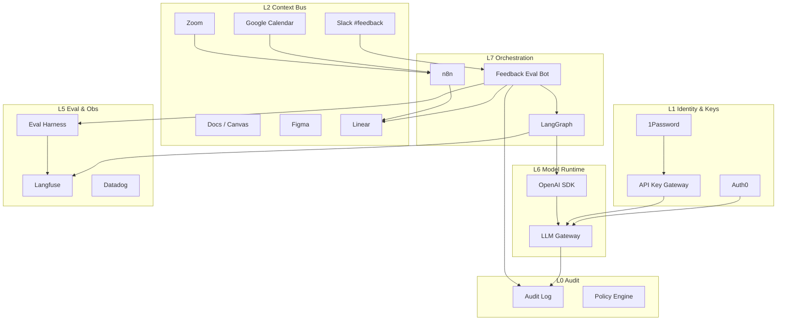

# AI Native 组织基建体系

> 目标：把「人写文档 → 人转发 → 人记事 → 人查数 → 人埋点」升级为「上下文自动流入 → Agent 可执行 → 结果可观测 → 知识可复用」的闭环，让团队以 AI 为默认协作界面。

**配套文档**

| 文档 | 用途 |
|------|------|
| [WORKFLOWS.md](./WORKFLOWS.md) | 端到端工作流（含 Slack 反馈→Bot 评估→Linear） |
| [SKILLS-MCP-PLUGINS.md](./SKILLS-MCP-PLUGINS.md) | Skill / MCP / Plugin 具体清单与契约 |
| [TOOLKIT-CHECKLIST.md](./TOOLKIT-CHECKLIST.md) | **可发给其他团队直接 Copy 的工具清单** |

---

## 1. 什么叫 AI Native 组织

不是「每人多装几个 AI 插件」，而是组织满足以下条件：

| 维度 | 传统数字化 | AI Native |
|------|-----------|-----------|
| 工作入口 | 人打开工具找信息 | Agent / Skill 带着上下文找你 |
| 知识形态 | 散落的 Doc / 会议 / 聊天 | 可检索、可引用、可冲突追溯的知识层 |
| 需求流转 | 会议 → 人工纪要 → 手动建单 | 录音/文档/反馈 → 评估 → Linear Issue |
| 交付方式 | 人写代码为主 | 人定义约束，AI 在沙箱与 Secrets 下执行 |
| 数据使用 | 人写 SQL / 找看板 | Agent 经受控语义层查询 |
| 质量保障 | 上线后看日志 | Harness 回归 + Langfuse + Datadog + Audit |
| 身份与密钥 | 各系统各管一套 | Auth0 统一身份 + API Key Gateway 统一密钥 |
| 协作语言 | 口头约定 | Scenario / Role / Input / Output / Constraint / Benchmark |

**核心原则**

1. **Information Bus 优先**：瓶颈是组织内信息流动，不是再找一个更强的模型。
2. **先打通高频关键路径**：先固化「反馈/会议→评估→任务→实现→观测」。
3. **AI Feature Spec 可机器读**：每个 Agent 必须结构化。
4. **Secrets / Endpoint / Auth 是契约**：没有进 Catalog 的能力，Agent 不可见。
5. **可观测 + 可审计 + 可评测**：没有 Trace / Audit / Harness，生成越多债越多。
6. **人机门禁写在默认路径上**：对外发送、发布、删改、高 PII 默认 HITL。

---

## 2. 总体架构（九层 + 横切）

从「公司正常运转」出发，在原七层上补齐 **身份运行时、模型网关、评测 Harness、审计**：

```text
┌──────────────────────────────────────────────────────────────────┐
│ L8 体验入口   Slack Bot · Claude · Codex · Cursor · Replit · IDE │
├──────────────────────────────────────────────────────────────────┤
│ L7 编排工作流  LangGraph · n8n · Calendar Triggers · Event Bus   │
├──────────────────────────────────────────────────────────────────┤
│ L6 模型运行时  OpenAI SDK · Claude API · LLM Gateway · Prompt Reg│
├──────────────────────────────────────────────────────────────────┤
│ L5 评测观测    Langfuse · Eval Harness · Datadog · Metabase      │
├──────────────────────────────────────────────────────────────────┤
│ L4 执行交付    Codex/CI · Feature Flag · Content Publish Gate    │
├──────────────────────────────────────────────────────────────────┤
│ L3 数据检索    Data Lake · Algolia · Metabase · CMS              │
├──────────────────────────────────────────────────────────────────┤
│ L2 知识上下文  Zoom · Docs · Figma · Canvas · Slack · Calendar   │
├──────────────────────────────────────────────────────────────────┤
│ L1 身份密钥    Auth0 · 1Password · API Key Gateway · SSO/RBAC    │
├──────────────────────────────────────────────────────────────────┤
│ L0 审计合规    Audit Log · Policy Engine · Retention · Red Team  │
└──────────────────────────────────────────────────────────────────┘
  横切：Front / Aircall（客户）· GitHub（代码）· Incident / Oncall
```



---

## 3. 从公司运转视角：原先遗漏与补齐

对照「一家公司每天如何运转」，以下能力是 AI Native 团队常漏、但必须有的：

| 能力域 | 为何必要 | 推荐落点 | 状态 |
|--------|----------|----------|------|
| **统一身份 (Auth0)** | 人、Bot、Agent、服务账号要同一套身份与 RBAC | Auth0 + Google Workspace SSO | 补齐 |
| **API Key 统一管理** | 模型/SaaS key 分散会导致泄露与无法计费 | API Key Gateway（见下）+ 1Password | 补齐 |
| **LLM Gateway** | 多模型路由、限流、成本、统一 OpenAI SDK 兼容 | 自建 Gateway 或 LiteLLM/Portkey 类 | 补齐 |
| **Calendar** | 会前简报、会后同步、Cycle 节奏都靠日历事件 | Google Calendar → n8n | 补齐 |
| **反馈闭环** | Slack 频道反馈需自动评估并进研发队列 | `#feedback` Bot → Harness → Linear | 补齐 |
| **Eval Harness** | Prompt/Agent 变更要像测代码一样测 | 离线数据集 + 在线采样打分 | 补齐 |
| **Audit** | 谁用了哪个 Agent、调了哪个工具、看了哪些 PII | 不可篡改审计流 → Lake / SIEM | 补齐 |
| **Incident / Oncall** | Agent 误写、密钥泄露、模型供应商挂了要有人接 | PagerDuty/Opsgenie + Slack `#incidents` | 补齐 |
| **CI/CD + 代码托管** | AI 写的代码必须过同样门禁 | GitHub + Actions + Required Checks | 补齐 |
| **环境分层** | dev / staging / prod 密钥与 Flag 隔离 | Auth0 Application + Key Gateway 按 env | 补齐 |
| **成本与预算** | Token/API 费用是 COGS | Gateway 配额 + Langfuse 成本看板 | 补齐 |
| **数据保留与删除** | 会议/通话/工单含 PII，要有 retention | Policy + Lake lifecycle | 补齐 |
| **服务目录 / ADR** | 避免每人发明一套集成 | Service Catalog + ADR 库 | 补齐 |
| **安全扫描** | 依赖与密钥扫描 | Gitleaks / Dependabot / SAST | 补齐 |
| **客户真相源** | Front/Aircall 之外要有账号/订阅上下文 | CRM 轻量字段或内部 Customer 360 只读 API | 建议 |
| **状态页 / 变更日志** | 对外与对内沟通发版 | Statuspage + Linear Releases / Changelog | 建议 |
| **设计系统可消费** | Figma token → 代码 | Tokens pipeline | 建议 |
| **向量/记忆层** | 长期记忆与会话摘要 | 向量库或 Algolia Neural + Memory MCP | 建议 |

### 3.1 Auth0（身份运行时）

| 主体 | Auth0 用法 |
|------|------------|
| 员工 | Google Workspace OIDC 登录内部工具 / Replit / Bot Admin |
| 客户 | 产品应用登录（如需要） |
| Agent / Bot | Machine-to-Machine（M2M）Application + 窄 scope |
| 服务 | Client Credentials；token 短时、可吊销 |

**规则**

- 人类用 Interactive Login；Agent 只用 M2M。
- Scope 与 Endpoint Catalog 的 `access_level` 对齐（`metrics:read`、`issues:write`…）。
- Auth0 Actions 里写：禁止生产 publish scope 发给非人工确认流。

### 3.2 API Key 统一管理（Key Gateway）

问题：OpenAI / Anthropic / Algolia / Datadog… 密钥散落在 Replit、CI、个人 `.env`。

**目标架构**

```text
1Password (真相源)
    ↓ 同步/注入
Key Gateway (唯一运行时出口)
    ↓ 签发短时凭证 / 代理转发
LangGraph · n8n · Replit · CI · Slack Bot
```

**Gateway 能力清单**

1. 按 `env × team × agent` 发放逻辑密钥（不是厂商原始 key）
2. 代理调用 OpenAI-compatible API（统一 base URL）
3. 配额、速率、模型白名单
4. 全量 Audit（谁、哪个 agent、哪个模型、token、成本）
5. 紧急吊销与轮换（1Password 轮换 → Gateway 热更新）

应用侧统一用 **OpenAI SDK**（或兼容 SDK）指向 Gateway：

```ts
import OpenAI from "openai";

const client = new OpenAI({
  apiKey: process.env.COMPANY_GATEWAY_KEY, // 公司逻辑 key
  baseURL: "https://llm-gateway.company.internal/v1",
});
```

### 3.3 Eval Harness（评测支架）

Harness ≠ Langfuse。Langfuse 负责 **记录与人工分**；Harness 负责 **可重复跑的门禁**。

| 组件 | 说明 |
|------|------|
| Dataset | 金标输入/期望输出/评分标准（存 Git 或 Langfuse Dataset） |
| Runners | 对某个 Agent/Prompt 版本批量回放 |
| Scorers | 规则分 + LLM-as-judge + 人工抽检 |
| Gate | CI：分数 < 阈值则禁止晋升 prod |
| Online Eval | 对 Slack 反馈 / 线上采样自动打分后写 Linear |

### 3.4 Audit（审计）

最少审计事件：

```yaml
AuditEvent:
  ts: datetime
  actor_type: human | agent | bot | system
  actor_id: string
  auth0_sub: string
  action: tool.call | llm.complete | issue.create | secret.resolve | content.publish
  resource: string
  agent_name: optional
  trace_id: langfuse_trace_id
  decision: allow | deny | hitl_required
  pii_touched: boolean
  meta: object
```

去向：Datadog Logs / Lake（长期）+ 异常告警到 `#security-alerts`。

### 3.5 Google Calendar

| 事件 | 自动化 |
|------|--------|
| 会议开始前 30min | Bot 推送：相关 Linear、上次决策、开放反馈 |
| 会议结束后 | 与 Zoom 转写合流 → Action Item |
| Sprint/Cycle 起止 | 自动生成进度摘要到 Slack + 更新 Linear cycle |
| Oncall 轮值 | Calendar 覆盖 → 告警路由 |

---

## 4. 工具地图（完整栈）

### 4.1 L0–L1 治理与身份

| 工具 | 职责 |
|------|------|
| **Auth0** | SSO、RBAC、M2M、用户/机器身份 |
| **1Password** | 密钥真相源、团队保险库 |
| **API Key Gateway** | 运行时唯一模型/SaaS 密钥出口 |
| **Audit Log** | 不可抵赖操作记录 |
| **Policy Engine** | 允许/拒绝/HITL（可先做在 Gateway + Auth0 Actions） |

### 4.2 L2 知识与上下文

| 工具 | 职责 |
|------|------|
| Claude / Canvas | 需求结构化、Spec |
| Zoom | 会议录音转写 |
| Google Docs | PRD / ADR / Runbook |
| Figma | 设计意图与约束 |
| Google Calendar | 时间触发与会前会后上下文 |
| Slack | 协作、`#feedback` 收集、Bot 入口 |
| Linear | 执行状态唯一真相源 |
| GitHub | 代码、Prompt、Harness、ADR |

### 4.3 L3 数据与检索

| 工具 | 职责 |
|------|------|
| Data Lake | 原始/治理数据 |
| Algolia | 低延迟检索 / RAG |
| Metabase | 语义层 SQL / 看板 |
| Contentful | CMS |
| Darklight | 内容/实验态 |
| Customer 360 API（建议） | 账号/订阅只读上下文 |

### 4.4 L4–L6 执行、模型、编排

| 工具 | 职责 |
|------|------|
| Codex / Claude Coding | 编码 |
| GitHub Actions | CI、Harness gate、密钥扫描 |
| Feature Flag / Darklight | 灰度 |
| **OpenAI SDK** | 统一模型调用客户端 |
| **LLM Gateway** | 路由、限流、计费、兼容层 |
| LangGraph | 有状态 Agent |
| n8n | 系统集成胶水 |
| Replit | PM 沙箱（Secrets + Endpoint） |

### 4.5 L5 观测与评测

| 工具 | 职责 |
|------|------|
| Langfuse | Trace、Prompt 版本、人工分、Dataset |
| **Eval Harness** | 回归门禁、在线评估 |
| Datadog | APM、RUM、业务埋点、告警 |
| Metabase | 业务与组织指标 |

### 4.6 L8 入口与横切

| 工具 | 职责 |
|------|------|
| Slack Bot | 反馈评估、查询、建单、简报 |
| Front | 邮件/工单 |
| Aircall | 通话 |
| Incident 工具 | 故障响应 |
| Status / Changelog | 变更沟通 |

---

## 5. 组织级闭环（六条）

### A. 会议 → 行动

Zoom/Calendar → 转写 → 结构化 → Slack + Linear

### B. 需求 → 交付

Claude Spec → Figma → Linear → Codex → CI/Harness → Flag → Datadog 验 AC

### C. 数据 → 决策

Lake → Metabase Gold → Bot/Agent 引用 Question ID → 写回 Docs/Linear

### D. Agent → 改进

Langfuse Trace → Bad case → Harness → 版本晋升 → 灰度

### E. 反馈 → 评估 → 研发（新增主路径）

```text
用户/同事在 Slack #feedback 发帖
  → Feedback Bot 接收（线程订阅）
  → 归一化（类型/严重度/产品面/是否可复现）
  → Eval（规则 + LLM judge + 可选 Harness 抽样）
  → 决策：
      - duplicate → 挂到已有 Linear + 回复线程
      - bug/req → 创建/更新 Linear（priority、label、AC 草稿）
      - needs_info → Bot 追问
      - spam/out_of_scope → 标记并关闭
  → Audit + Langfuse trace
  → 每日摘要到 #feedback-triage
```

详见 [WORKFLOWS.md](./WORKFLOWS.md)。

### F. 身份 → 调用 → 审计（控制面闭环）

Auth0 发 token → Key Gateway 放行 → 工具调用 → Audit/Langfuse → 异常吊销

---

## 6. 角色 × AI 能力矩阵

| 角色 | 默认入口 | 必须掌握 | 禁止 |
|------|----------|----------|------|
| PM | Claude + Replit + Linear | Feature Spec、Endpoint、反馈优先级 | 生产 key 进 Doc |
| Design | Figma + Claude | 可被代码消费的约束 | 无状态机的纯视觉稿 |
| Eng | Codex + LangGraph + Harness | Tool schema、门禁、埋点 | 无 Trace 上生产 |
| Data | Metabase + Lake | Gold 语义层 | Agent 任意写 SQL |
| Ops/CS | Front + Slack Bot | 升级规则、HITL | 自动对外发送 |
| Security | Auth0 + Audit + Gateway | 轮换、scope、红队 | 长期上帝密钥 |
| Leadership | 周报 Bot | 组织层指标 | 用聊天替代 Linear |

---

## 7. Endpoint Catalog + 密钥契约

| 字段 | 说明 |
|------|------|
| `endpoint_id` | 稳定 ID |
| `system` | linear / metabase / slack / ... |
| `method_path` | `GET /api/...` |
| `auth` | Auth0 scope 或 Gateway policy |
| `secret_ref` | 1Password / Gateway 逻辑名 |
| `access_level` | read / draft_write / publish / admin |
| `pii_class` | none / low / high |
| `allowed_agents` | 白名单 |
| `rate_limit` | QPS / day |
| `owner` | 负责人 |
| `runbook` | 故障与回滚 |

**没有进 Catalog = Agent 不可见。**

---

## 8. 安全红线（摘要）

1. 厂商原始 API Key 只存在 1Password → 仅 Gateway/CI 注入。
2. 应用只持有公司逻辑 Key（可吊销、有配额）。
3. 高 PII / publish / 对外发送：默认 HITL。
4. 数字结论必须带 Metabase Question / Doc / Linear ID。
5. Prompt、Agent、Harness、策略全部进 Git。
6. 审计日志不可由 Agent 删除。

---

## 9. 演进阶段

| Stage | 能力 |
|-------|------|
| 0 对齐 | 账号、频道、Linear、1Password 分库 |
| 1 Information Bus | Zoom/Docs/Calendar → Slack/Linear；`#feedback` 人工标签 |
| 2 受控运行时 | Auth0 M2M、Key Gateway v1、OpenAI SDK 统一、Langfuse |
| 3 反馈自动化 | Feedback Bot + 在线评估 + 自动建 Linear |
| 4 Harness 门禁 | PR 必过评测集；双周 Prompt Review |
| 5 组织 OS | 统一 MCP、组织看板、onboarding=授 Skills |

---

## 10. 仪式与 90 天清单

| 仪式 | 频率 |
|------|------|
| AI Standup | 每日 |
| Feedback Triage | 每日（Bot 摘要 + 人确认边界 case） |
| Prompt/Harness Review | 双周 |
| Catalog / Scope Office Hour | 双周 |
| Knowledge Gardening | 每周 |
| Key Rotation Drill | 每月 |
| Game Day | 每季 |

**90 天**

- [ ] `#feedback` → 评估 → Linear 主路径跑通（含 duplicate 检测）
- [ ] Auth0 区分人与 M2M；生产 publish 需 HITL
- [ ] API Key Gateway 覆盖 OpenAI/Anthropic；业务侧无裸 key
- [ ] 会议/Calendar Action Item 自动进 Linear
- [ ] 所有生产 Agent：Langfuse + Audit + Harness 基线集
- [ ] Metabase Gold Collection 供 Agent 专用
- [ ] Datadog 关键路径埋点可对照 AC
- [ ] Incident 频道与密钥泄露 runbook 可用
- [ ] 新成员第 1 周靠 Slack Bot + Skills 完成查决策/建单/看指标

---

## 11. 一页纸

```text
身份（Auth0）→ 密钥（1Password/Gateway）→ 模型（OpenAI SDK）
  → 编排（n8n / LangGraph）→ 工作（Linear / Code / Content）
  → 反馈（Slack）→ 评估（Bot + Harness）→ 回流（Linear）
  → 观测（Langfuse / Datadog）→ 审计（Audit）→ 改进
```

---

## 附录：工具 → 层级速查

见 [TOOLKIT-CHECKLIST.md](./TOOLKIT-CHECKLIST.md)（对外复制版）。

*维护：随 Catalog、Agent、Harness、Auth0 scope 变更更新。*
